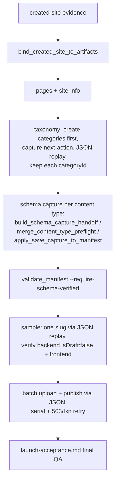

# Source Files To Site Package

Use this reference when the user provides PDFs, DOCX files, spreadsheets, Markdown/TXT files, images, source websites, or briefs and wants Codex to generate a publishable AllinCMS site: site information, single pages, products, posts, forms, media needs, navigation, and later upload manifests.

This stage is local planning and content synthesis. It does not authorize creating a site, saving content, publishing, uploading media, binding domains, or replaying JSON requests.

## Stage Contract

The workflow has six gates:

```text
1. Source intake: copy or reference user files into a run folder outside the skill package.
2. Raw extraction: extract text/tables/images/URLs with source pointers; preserve raw files.
3. Wiki distillation: write a neutral local wiki layer with facts, claims, open questions, product taxonomy, page plan, article plan, and source references.
4. Site package generation: build an allincms_source_site_package JSON from the wiki layer.
5. Review packet: generate a redacted local review packet for the user with counts, paths, slugs, previews, source refs, operation gaps, and blocked actions.
6. User confirmation: user approves site name, description, sitemap, product/post scope, contact policy, media policy, form policy, and any unsupported/omitted fields from the review packet.
7. AllinCMS execution: create/select site, capture current schemas, build schema-verified manifests, upload one sample, batch upload, publish, verify forms/media/settings or record explicit deferrals, then run final frontend launch acceptance.
```

Do not skip gate 4 or 5 because source text looks complete. A PDF or catalog can support draft content, but it cannot confirm domains, tracking snippets, notification emails, final contact channels, route visibility, pricing/inventory policy, or unsupported certification claims unless the user explicitly accepts it as authoritative.

When a source file includes public contact details such as email addresses or phone-like values, preserve the planning fact but redact the value before it enters `source-wiki.json`, review packets, manifests, or execution artifacts. Represent it as a contact status such as `provided_in_source_redacted`, `contactType=email`, `valueRedacted=true`, and `requiresUserConfirmation=true`. The user can later confirm the actual public contact value during site-info/forms/settings execution; do not store raw contact values in skill references or reusable artifacts.

## Runtime Folder Boundary

Keep all source-derived artifacts outside `skills/allincms-bulk-content-upload/`, usually under `~/allincms-projects/allincms-source-run-<slug>/` or a user-approved project folder:

```text
source-index.json
raw-extraction/
wiki/
source-wiki.json
source-input-requirements.json
source-site-package.json
source-package-review-packet.json
products-draft-manifest.json
posts-draft-manifest.json
confirmation-record.json
taxonomy-plan.json
schema-capture/
upload-readiness.json
run-evidence/
```

Never store business copy, raw PDF text, private communication, customer files, concrete media URLs, domains, account labels, cookies, headers, server-action IDs, or content IDs in the skill package.

## Source Inventory

For normal user-file runs, start with the local-only preparation orchestrator:

```bash
python3 skills/allincms-bulk-content-upload/scripts/prepare_source_site_package.py \
  ~/allincms-projects/run/source-files \
  --recursive \
  --output-dir ~/allincms-projects/run \
  --site-name "Draft site name" \
  --site-description "Draft source-backed positioning" \
  --industry "target industry"
```

For a real operator run where the user may provide files first, then an AI-refined wiki, then confirmation text, prefer the rehearsal wrapper so the stop point is explicit:

```bash
python3 skills/allincms-bulk-content-upload/scripts/run_source_file_rehearsal.py \
  ~/allincms-projects/run/source-files \
  --recursive \
  --output-dir ~/allincms-projects/run/source-rehearsal \
  --site-name "Draft site name" \
  --site-description "Draft source-backed positioning" \
  --industry "target industry"
```

The wrapper is still local-only. Without refinement it may stop at `readyForBrowserStage=needs_source_wiki_refinement` for briefs whose pages are thin or whose package still has placeholders. When the extracted products/posts/site plan are usable and the blocker is normal thin page copy, rerun with `--auto-draft-refined-source-wiki`; it writes the current run's `source-wiki.refined.json`, applies it, and may advance to `waiting_for_user_content_confirmation` if all source/package/review validation passes:

```bash
python3 skills/allincms-bulk-content-upload/scripts/run_source_file_rehearsal.py \
  ~/allincms-projects/run/source-files \
  --recursive \
  --output-dir ~/allincms-projects/run/source-rehearsal \
  --site-name "Draft site name" \
  --site-description "Draft source-backed positioning" \
  --industry "target industry" \
  --auto-draft-refined-source-wiki
```

The auto draft path expands thin pages and fills reviewable navigation/site-info/media/contact/taxonomy policy defaults from the current source wiki. It does not invent confirmed domains, tracking snippets, public contacts, legal names, prices, inventory, media proof, or AllinCMS payload schemas. If a source declares `contentGoals.media` but provides no real media files or URLs, auto draft should satisfy the declared scope by adding explicit page/product/post `mediaNeeds` with `status=needs_user_confirmation`, `requiresSchemaCapture=true`, and `requiresFrontendImageProof=true`; it must not fabricate image URLs or placeholder assets. If auto draft still leaves `reviewReady=false`, inspect `refined-source-wiki-apply-summary.json` and `source-wiki-refinement-plan.json`, then refine manually.

When auto draft or a manual refined wiki is applied successfully, use the chosen review packet and confirmation quality review as the current package quality signal. The initial `sourcePrepare.contentQuality.readyShape` may remain `false` because it describes the pre-refinement package that triggered the refinement. Do not let that stale pre-refinement shape override `reviewReady=true` or `objectiveAudit.readyShape=true` from the refined package.

When the source site plan contains navigation paths, treat static navigation routes as page requirements. The auto-draft refinement should create page entries for static paths such as `/applications`, `/about-us`, `/contact-us`, or other non-dynamic navigation pages when they are missing from `pages`. Do not create duplicate page entries for reserved list/detail routes such as `/`, `/products`, `/posts`, `/news`, `/blog`, search, categories, tags, or dynamic `{slug}` routes. A review-ready package should not show a navigation link to a static route that has no matching page plan.

When a structured source file such as JSON includes explicit `pages`, `navigation`, `siteName`, `siteDescription`, `industry`, or `contentGoals`, preserve those fields into the source wiki and source-site package. Treat `contentGoals.pages/products/posts/navigationItems/productCategories/postCategories/forms/media/siteInfoFields` as minimum declared scope: a package cannot be review-ready if it generates fewer items or populated fields than the source file explicitly requested. For media, count both explicit media plan entries and source-declared page/product/post media needs; for site info, count populated launch fields such as SEO title, SEO description, public contact, legal company name, and logo policy. The review packet must expose navigation item previews and taxonomy counts/slugs, not only object keys, so the user can confirm visible menu paths, category scope, forms, media policy, and site-info scope before any browser work.

When source text names required pages in prose, for example `Required pages:` or `Pages:` followed by a list, treat those page labels as page-scope evidence even if the structured navigation list omits some of them. Auto-draft refinement should create source-backed static pages for non-reserved labels such as about, applications, contact, solutions, or resources until the declared page goal is met. Reserved list/detail routes such as `/`, `/products`, `/posts`, `/news`, `/blog`, category/tag/search pages, and dynamic routes remain route/module requirements, not standalone page entries.

When `contentGoals.postCategories` or `contentGoals.productCategories` declares more taxonomy terms than the raw extraction produced, let the local auto-draft refinement fill a reviewable taxonomy draft from item categories, post titles, and tags before stopping for manual wiki edits. The generated terms are still user-confirmed planning data only: they require taxonomy confirmation, current-site category/tag schema capture, and backend mapping proof before products/posts or homepage modules rely on them.

When `contentGoals.forms`, `contentGoals.media`, or `contentGoals.siteInfoFields` declares scope beyond the generated package, treat that as a blocking source-package coverage gap, not as a later browser-only detail. Forms, media, and site-info fields remain planning artifacts until current-site schemas and proof exist, but the source package must still surface enough confirmed or explicitly deferred structure for review before the run can advance to create/select-site execution.

For declared media goals, read coverage from `validate_source_site_package.content_goal_coverage(package)` or the review packet's `contentGoalCoverage`; the source package itself does not store a top-level `contentGoalCoverage` field. `counts.media` includes explicit media entries, page/product/post media needs, and image-field obligations. Do not use `contentPlan.media` length alone to decide whether the declared media goal is covered.

Treat `contentGoals` as minimum source scope, not an automatic maximum. If the package generates fewer pages/products/posts/navigation/taxonomy/forms/media/site-info fields than declared, block review readiness. If source extraction or auto-draft generates more than declared, keep the extra source-backed items only when they pass package validation, but surface `exceeds_declared_content_goal:<field>` in `contentQualityReview.warnings`, `suggestedConfirmationText`, and `contentGoalOverages.details.<field>`. The overage detail must include declared count, actual count, extra count, generated item titles/slugs/paths/source refs where available, and likely extra candidates when item order permits. This warning is non-blocking for shape readiness, but item-level overage details must be visible before user confirmation so the user can accept the expanded scope, request pruning, or ask for regeneration.

After AI/user refinement, rerun with `--refined-source-wiki ~/allincms-projects/run/source-wiki.refined.json`; if the package is review-ready and no confirmation text is supplied, it stops at `waiting_for_user_content_confirmation`. A refined wiki is path-bound to the current run's `source-wiki-refinement-brief.json` through `outputRefinedSourceWiki`. If you change `--output-dir`, regenerate the refined wiki for that run or use `--auto-draft-refined-source-wiki` again; do not reuse a refined file from another run folder. After the user confirms the review packet, rerun with `--user-confirmation-text "<current confirmation text>"` to generate confirmation, execution plan, draft artifacts, source execution status, and next-stage handoff. When confirmation text is supplied and `--accepted-fields` / `--accepted-deferral` are omitted, the wrapper uses the same review packet's `suggestedAcceptedFields` and `suggestedAcceptedDeferrals`; explicit CLI values still override those suggestions. This wrapper does not create a site or authorize browser mutations; it only proves which local or browser gate is next.

The lower-level confirmation and confirmed-execution helpers follow the same default. If `--accepted-fields` and repeated `--accepted-deferral` flags are omitted, they inherit the current review packet's suggested accepted fields and suggested deferrals. This makes resumed runs safe when the user has already accepted the review packet and only the current confirmation text is being supplied. Do not hand-invent acceptance fields from memory; use explicit flags only when the user overrides the review packet's suggestions.

On macOS, `/tmp/...` and `/private/tmp/...` may point to the same artifact. Validators should compare resolved file paths plus sha256 identity for source package / review packet bindings, not fail only because one artifact records `/private/tmp` while a resumed command passes `/tmp`. Treat content hash mismatch as a blocker, but path spelling aliases alone are not drift.

For `target-mode=new_site`, confirmation without fresh create-site preflight must stop at `readyForBrowserStage=needs_create_site_preflight`. The next-stage handoff should expose `needsCreateSitePreflight=true`, `browserWorkRequired=false`, and a preflight blocker. Do not treat `currentStage=create_site_handoff` as permission to open the browser mutation path until the `/sites` preflight has been collected and the confirmed create-site handoff/runbook exist.
The top-level `run_source_file_rehearsal.py` summary must echo the confirmed execution helper's `nextAction` at this boundary. If `readyForBrowserStage=needs_create_site_preflight`, the summary should direct the operator to `create-site-preflight-brief.json`, not to the browser create/select-site stage.
At the same boundary, `objectiveAudit.nextBlockingRequirement` must be `create-site read-only preflight collected`, not the later `remote site created or selected and bound to artifacts` requirement. Only after preflight has produced a confirmed create-site handoff/runbook, or after an existing-site read-only refresh path is selected, may the objective audit move to remote site creation/selection proof as the next blocker.

After a valid confirmed create-site handoff exists, the source execution status can advance to `created_site_binding`. At that point the local runbook is already prepared; the next required work is the gated one-submit browser create-site action followed by filled created-site evidence. Do not rebuild or reinterpret the handoff as created-site proof. When `readyForBrowserStage=create_site_handoff_ready`, the rehearsal validator must reopen and cross-check the create-site handoff, create-site browser runbook, created-site evidence brief, created-site evidence bundle, and the handoff/runbook/evidence-bundle validation artifacts. If any artifact is missing, `valid` is not true, or the paths do not bind to each other, regenerate confirmed execution artifacts before browser work.

The wrapper writes `source-file-rehearsal-validation.json` automatically and fails if its own summary does not validate. When reusing an older copied summary, or after moving artifacts between folders, rerun the validator before using it as the operator index:

```bash
python3 skills/allincms-bulk-content-upload/scripts/validate_source_file_rehearsal.py \
  ~/allincms-projects/run/source-rehearsal/source-file-rehearsal-summary.json \
  --output ~/allincms-projects/run/source-rehearsal/source-file-rehearsal-validation.json \
  --fail-on-invalid
```

In `source-file-rehearsal-summary.json`, treat `artifacts.sourceExecutionStatus` and `artifacts.sourceNextStageHandoff` as the current-stage pointers. After refinement they must point to the refined status and refined next-stage handoff; after confirmation they must point to the confirmed execution status and confirmed next-stage handoff. Historical initial preparation paths may exist as `initialSourceExecutionStatus` and `initialSourceNextStageHandoff`, but do not continue browser or local stages from those stale initial paths once the run has advanced to confirmation or create-site preflight. The rehearsal validator rejects summaries whose top-level current handoff does not match the active stage.

This check reopens the package, review packet, confirmation brief, and confirmed execution artifacts when present. It catches copied or hand-edited summary drift before content confirmation or browser continuation. Passing this validator is still local proof only; it does not authorize site creation, saving, uploading, publishing, routing, or settings changes.

Evidence bundles and input bundles are stage-bound. When a helper prepares pages/site-info, taxonomy, manifest-sample, batch-upload, forms/media/settings, or launch-acceptance bundles, preserve the source current stage and any handoff preflight/blocker fields inside the bundle. `prepare_source_next_stage.py` must reject a bundle that declares `blocked`, non-empty `blockers`, non-empty `handoffPreflightIssues`, `validation.ok=false`, or a `sourceCurrentStage` / `sourceStatusCurrentStage` that does not match the current apply stage. Do not let a bundle with convenient paths produce an apply command after the upstream handoff has changed or declared preflight blockers.

For `pages_site_info_execution`, frontend proof must show that source-confirmed page content replaced the starter template. A site-info title match, active default theme, published default pages, bound routes, HTTP 200, or nonblank frontend is not enough. Fill each page's `renderAudit` with explicit source-content signals, prove starter-template signals are absent, and keep the run blocked if any default commerce/template body, product, post, navigation, or image copy still dominates the public page.

When `currentStage=taxonomy_execution_handoff`, inspect the taxonomy handoff itself before emitting a local command. If it reports `readyForBrowserStage=blocked_taxonomy_preflight` or non-empty `preflightIssues` such as `preflight.setupPages.products` / `preflight.setupPages.posts`, the next-stage handoff must surface `handoffReadyForBrowserStage`, `handoffPreflightIssues`, `blocker`, and `browserWorkRequired=true`, with no `localCommand`. The next operator action is a read-only refresh of the missing products/posts setup evidence and then regenerating taxonomy preparation. Do not rerun created-site schema preparation or prepare taxonomy mutations from a blocked taxonomy handoff.

When `currentStage=schema_capture_handoff`, inspect the schema-capture handoff before treating it as a generic browser boundary. If any stage reports `status=needs_readonly_content_preflight`, the next-stage handoff must surface `handoffReadyForBrowserStage=needs_readonly_content_preflight`, `handoffPreflightIssues` such as `preflight.contentTypes.posts`, `handoffBlockedContentTypes`, `blocker`, and `browserWorkRequired=true`, with no `localCommand`. The next operator action is read-only list/edit inspection for those content types, `merge_content_type_preflight.py`, then rebuilding `build_schema_capture_handoff.py`. Do not create product/post probes until the relevant content type is `ready_for_create_probe_authorization`.

Use `source-file-rehearsal-summary.json` as the first operator index before browser mutation. Its `artifacts.*Summary` keys point to helper summary files, while `*SourceExecutionStatus` and `*SourceNextStageHandoff` keys point to executable gate/state artifacts. The wrapper also writes `source-confirmation-brief.json`, `source-confirmation-brief.md`, and `source-confirmation-brief-validation.json`; use those as the compact user-facing confirmation surface before asking the user to approve content intent. The brief merges `confirmationReview`, `objectiveAudit`, and `sourceReviewObjectiveCoverage`, exposes counts, coverage, content-goal overage item details, accepted fields, suggested deferrals, a `confirmationDecisionMatrix`, command templates, local review-completion status, and the next blocking requirement, while keeping `isRemoteMutationAuthorization=false`. The decision matrix must cover every review-packet `confirmationFields` row as either `accept` or `defer`; any `missing_decision` blocks confirmation and browser continuation. If `reviewReady=true`, the brief must also show `sourceReviewObjectiveCoverage.reviewComplete=true`, `complete=false`, `remoteMutationAllowed=false`, empty `missingForReview`, and live-stage blockers in `missingForFinal`. The validation file must report `ok=true`; if a brief has been copied, edited, or reused across sessions, rerun:

```bash
python3 skills/allincms-bulk-content-upload/scripts/validate_source_confirmation_brief.py \
  ~/allincms-projects/run/source-rehearsal/source-confirmation-brief.json \
  --summary ~/allincms-projects/run/source-rehearsal/source-file-rehearsal-summary.json \
  --output ~/allincms-projects/run/source-rehearsal/source-confirmation-brief-validation.json
```

After the user confirms content intent, or when resuming from a copied brief, consume the brief's `executionIntake` instead of parsing Markdown or hand-copying long command strings:

```bash
python3 skills/allincms-bulk-content-upload/scripts/prepare_source_confirmation_next_step.py \
  ~/allincms-projects/run/source-rehearsal/source-confirmation-brief.json \
  --summary ~/allincms-projects/run/source-rehearsal/source-file-rehearsal-summary.json \
  --user-confirmation-text '<paste current user confirmation text here>' \
  --output ~/allincms-projects/run/source-rehearsal/source-confirmation-next-step.json
```

The next-step handoff is local-only. In `await_user_confirmation_text` mode it may emit a `localCommand` that prepares confirmed execution artifacts. In `collect_create_preflight` mode it points to the read-only `/sites` create-preflight evidence target. In `run_gated_create_site` mode it points to the non-executable create-site runbook and evidence bundle, but still requires action-time authorization plus the create-site pre-mutation gate before any browser submit.

After the user confirms content intent, preserve `contentGoalOverages` together with `contentGoalCoverage`, `contentQualityReview`, `wikiReview`, and `confirmationDecisionMatrix` in every source-context artifact: confirmation record, confirmed execution plan, artifact readiness, create-site handoff/runbook/evidence bundle, created-site binding, pages/site-info, taxonomy, schema/sample/batch, forms/media/settings, launch inputs, final closeout, and status summaries. If any artifact drops or changes the overage details while `contentQualityReview.warnings` still includes `exceeds_declared_content_goal:*`, stop and rebuild from the review packet or confirmation record. The user confirmed an expanded scope only because those item-level details were visible; losing them after confirmation is scope drift.

`sourceReviewObjectiveCoverage` is an optional but sticky member of that same source-context chain. Pass `make_source_review_objective_coverage.py` output into `make_source_package_confirmation.py --source-review-objective-coverage` (or `prepare_confirmed_site_execution.py --source-review-objective-coverage`; `run_source_file_rehearsal.py` wires it automatically). Once carried, the confirmation record, confirmed execution plan, artifact readiness, source execution status, and next-stage handoff all keep the same coverage object. Each stage enforces that a carried coverage still reads `reviewComplete=true`, `complete=false`, `remoteMutationAllowed=false`, empty `missingForReview`, and the live blockers (`remote_site_creation_not_started`, `schema_capture_not_started`, `sample_batch_upload_not_started`, `final_launch_not_started`) still listed in `missingForFinal`. `validate_plan()` rejects a plan whose carried coverage claims the full objective is done; `export_confirmed_site_artifacts.py` refuses to export when the confirmation carries coverage but the plan drops or mutates it; and `summarize_source_execution_status.py` blocks the `source_package` stage on any mismatch. The point is to stop a locally review-complete package from being read as a live target completion after confirmation — the objective is still open until live site creation/selection, schema capture, sample/batch upload, launch, cleanup, and closeout are proven.

When the handoff reports `localCommandReady=true`, apply the local stage with the apply helper instead of copying the command by hand:

```bash
python3 skills/allincms-bulk-content-upload/scripts/apply_source_confirmation_next_step.py \
  ~/allincms-projects/run/source-rehearsal/source-confirmation-next-step.json \
  --output-dir ~/allincms-projects/run/source-rehearsal/confirmed-from-next-step \
  --output ~/allincms-projects/run/source-rehearsal/confirmed-from-next-step/apply-result.json
```

The apply helper only executes local confirmed-execution preparation. If the handoff is at a browser boundary, it writes `browser_boundary_not_applied`; use that boundary to collect read-only preflight or run a separately gated create-site stage. Do not treat an apply result as browser proof.

After a successful local apply, read `apply-result.json.artifacts` as the compact continuation index. It mirrors the top-level confirmed execution summary/status/handoff paths and also exposes the confirmation record, execution plan, artifact readiness, draft manifests, create-site preflight/runbook/evidence-bundle paths when they exist. Do not reopen nested summaries just to discover normal continuation paths; use nested summaries only for diagnostics or validator repair.

For mid-run status answers such as "can we batch upload now?", "what is next?", or "how far are we?", generate a compact progress report from the existing current artifact. Do not call `summarize_source_execution_status.py` as a reader; that helper rebuilds a status file from component paths and requires `--output`.

```bash
python3 skills/allincms-bulk-content-upload/scripts/make_source_progress_status.py \
  --source-status ~/allincms-projects/allincms-run/source-execution-status.json \
  --final-acceptance ~/allincms-projects/allincms-run/launch-acceptance-applied/source-run-acceptance-validation.json \
  --objective "source files to confirmed AllinCMS site with pages, products, posts, and launch proof" \
  --output ~/allincms-projects/allincms-run/source-progress-status.json
```

Before remote work exists, use the rehearsal summary instead:

```bash
python3 skills/allincms-bulk-content-upload/scripts/make_source_progress_status.py \
  --rehearsal-summary ~/allincms-projects/allincms-run/source-file-rehearsal-summary.json \
  --objective "source files to confirmed AllinCMS site with pages, products, posts, and launch proof" \
  --output ~/allincms-projects/allincms-run/source-progress-status.json
```

Treat `source-progress-status.json` as a status/communication artifact only. It can report that batch upload is blocked, or that batch preparation is ready after schema manifests and samples pass, but it never authorizes batch upload and never replaces final source-run acceptance. Read `nextActionGate` before answering or continuing: `requiresUserContentConfirmation=true` means ask/record content confirmation, `requiresReadOnlyBrowserEvidence=true` means collect `/sites` or module read-only evidence, and `requiresActionTimeAuthorization=true` means prepare exact action authorization plus the matching pre-mutation gate before any browser mutation. `remoteMutationAllowed` must remain `false` in this progress artifact. `sourceStatusComplete=true` only means the local execution status has no remaining stage blocker; the full objective is complete only when `complete=true`, which requires an accepted final source-run acceptance report through `--final-acceptance`.

`run_source_file_rehearsal.py` writes `source-review-objective-coverage.json` automatically whenever the active review packet is ready. Before asking for user content confirmation from an older standalone review packet, or after copying review artifacts across folders, regenerate the same pre-browser objective coverage report:

```bash
python3 skills/allincms-bulk-content-upload/scripts/make_source_review_objective_coverage.py \
  ~/allincms-projects/allincms-run/source-package-review-packet.json \
  --package ~/allincms-projects/allincms-run/source-site-package.json \
  --objective "source files to confirmed AllinCMS site with pages, products, posts, and launch proof" \
  --output ~/allincms-projects/allincms-run/source-review-objective-coverage.json \
  --fail-if-not-review-ready
```

Treat `reviewComplete=true` as local confirmation readiness only. It proves that files, wiki, package, review packet, counts, policies, and confirmation fields are ready to show the user. It must still report `remoteMutationAllowed=false` and `complete=false`; site creation/selection, schema capture, sample upload, batch upload, frontend launch, cleanup, adversarial checks, and sedimentation remain missing for the full objective.

When reporting full objective completion, run `make_source_objective_coverage.py` from the final source-run acceptance report and require `complete=true`. The coverage report must include `adversarial_checks_completed=proven`; if the final acceptance report lacks adversarial checks or the final round closeout lacks accepted sedimentation/proof, the original "files -> wiki -> pages/products/posts -> site creation/upload/launch" objective is not complete even if content routes render.

When `reviewReady=true`, read `confirmationReview` first if you need raw packet details: it mirrors the review packet's counts, content-goal coverage, site preview, operation gaps, taxonomy/media/contact policies, suggested confirmation text, accepted fields/deferrals, and same-run confirmation/execution command templates. Use `source-confirmation-brief.md` for the user-facing summary; do not hand-copy counts, deferrals, or command paths from memory. Then read `objectiveAudit`: it lists the source-file objective requirements that are proven locally and the first requirement still blocked or not proven. If `objectiveAudit.complete=false`, report the next missing live proof instead of claiming the website or upload run is complete. Do not treat `confirmationReview`, `source-confirmation-brief`, or `objectiveAudit` as remote mutation authorization. Do not proceed to browser work until the relevant handoff path exists and matches the reported `readyForBrowserStage`.

It writes:

```text
source-index.json
raw-extraction/summary.json
source-wiki.json
wiki/index.md
wiki/site.md
wiki/pages.md
wiki/products.md
wiki/posts.md
wiki/manifest.json
source-input-requirements.json
source-site-package.json
source-wiki-refinement-plan.json
source-wiki.refined.json only when auto-draft or manual refinement writes it
source-package-review-packet.json only when publication-ready
source-confirmation-brief.json
source-confirmation-brief.md
source-confirmation-brief-validation.json
source-execution-status.json
source-next-stage-handoff.json
prepare-source-site-package-summary.json
```

The summary `packageStatus` is the first decision point:

```text
review_ready = safe to show the review packet and ask for content-intent confirmation
needs_source_wiki_refinement = source wiki/package still contains placeholders, thin copy, or unresolved questions
blocked_structural_package = generated package is structurally invalid and must be repaired before review
```

This orchestrator does not perform remote work. It can perform deterministic local refinement when `--auto-draft-refined-source-wiki` is set, but that is still only a draft review surface. If source files are unstructured or auto draft is insufficient, expect `needs_source_wiki_refinement`; use the generated `source-wiki-refinement-brief.json` as the AI/operator task contract, write the refined wiki to that brief's `outputRefinedSourceWiki`, then apply the refined wiki through the deterministic package/review/status helper. Do not use a non-review-ready package for user confirmation, site creation, or upload planning.

`prepare_source_site_package.py` writes the refinement brief by default. If the brief is missing, stale, or needs to be rebuilt after manual issue edits, regenerate it locally:

```bash
python3 skills/allincms-bulk-content-upload/scripts/make_source_wiki_refinement_brief.py \
  --source-wiki ~/allincms-projects/run/source-wiki.json \
  --refinement-plan ~/allincms-projects/run/source-wiki-refinement-plan.json \
  --site-markdown ~/allincms-projects/run/wiki/site.md \
  --pages-markdown ~/allincms-projects/run/wiki/pages.md \
  --products-markdown ~/allincms-projects/run/wiki/products.md \
  --posts-markdown ~/allincms-projects/run/wiki/posts.md \
  --output ~/allincms-projects/run/source-wiki-refinement-brief.json \
  --output-refined-source-wiki ~/allincms-projects/run/source-wiki.refined.json
```

The brief is local-only and non-authorizing. It lists exact `sourceWikiTarget` edits, the output contract for `source-wiki.refined.json`, validation commands, and adversarial checks. Use it as the prompt/task contract for the AI rewriting pass; do not ask for user confirmation from the brief itself. After writing the refined wiki, validate the refined wiki against the same brief before applying it:

```bash
python3 skills/allincms-bulk-content-upload/scripts/validate_refined_source_wiki_contract.py \
  --refined-source-wiki ~/allincms-projects/run/source-wiki.refined.json \
  --refinement-brief ~/allincms-projects/run/source-wiki-refinement-brief.json \
  --inventory ~/allincms-projects/run/source-index.json \
  --output ~/allincms-projects/run/refined-source-wiki-contract-validation.json
```

The refined wiki should preserve `sourceRef` values. It may omit `sourceSet.inputFiles[].sha256` and `sizeBytes` because the AI rewrite task is about content, not source-file bookkeeping. When `--inventory` is supplied, `validate_refined_source_wiki_contract.py` hydrates missing source fingerprints from matching inventory refs before running source-wiki validation and reports `sourceFingerprintsHydrated=true`. A reported hydration is acceptable only when refs match the current inventory; mismatched or unknown refs remain blockers.

Then run `apply_refined_source_wiki.py` and require `reviewReady=true`. When using the rehearsal wrapper, pass `--refined-source-wiki`; it forwards the generated refinement brief into the apply helper so copied-path drift and placeholder leakage are caught automatically.

For the common case where only single-page copy is too thin, use the local draft helper instead of hand-writing a refined wiki from memory:

```bash
python3 skills/allincms-bulk-content-upload/scripts/draft_refined_source_wiki.py \
  --source-wiki ~/allincms-projects/run/source-wiki.json \
  --refinement-brief ~/allincms-projects/run/source-wiki-refinement-brief.json \
  --inventory ~/allincms-projects/run/source-index.json \
  --validate-contract
```

It writes to the brief's `outputRefinedSourceWiki` unless `--output` is supplied. Use this helper only as a starter draft: after it writes `source-wiki.refined.json`, still run `apply_refined_source_wiki.py` and require `reviewReady=true` before showing a confirmation brief.

After AI/user refinement, use:

```bash
python3 skills/allincms-bulk-content-upload/scripts/apply_refined_source_wiki.py \
  --source-wiki ~/allincms-projects/run/source-wiki.refined.json \
  --refinement-brief ~/allincms-projects/run/source-wiki-refinement-brief.json \
  --inventory ~/allincms-projects/run/source-index.json \
  --requirements ~/allincms-projects/run/source-input-requirements.json \
  --output-dir ~/allincms-projects/run/refined-source-apply
```

It writes:

```text
source-site-package.refined.json
source-site-package.refined-validation.json
refined-source-wiki-contract-validation.json when --refinement-brief is supplied
wiki/index.md
wiki/site.md
wiki/pages.md
wiki/products.md
wiki/posts.md
wiki/manifest.json
source-wiki-refinement-plan.json
source-package-review-packet.refined.json only when publication-ready
source-execution-status.after-refined-wiki.json
source-next-stage-handoff.after-refined-wiki.json
refined-source-wiki-apply-summary.json
```

Use the Markdown wiki files to inspect and refine the site proposal, page plan, product plan, post plan, taxonomy, media policy, contact/form policy, and open questions. Use `source-wiki-refinement-plan.json` as the field-level checklist when validation blocks review: each item maps an issue to a source-wiki target, classification, and suggested action. Use the review packet only when the summary says `reviewReady=true`. If it says `source_wiki_refinement`, fix the listed source wiki, package, or review packet issues first. This helper remains local-only and does not authorize or perform AllinCMS mutations.

Both the initial preparation helper and the refined-wiki apply helper write a `sourceNextStageHandoff` artifact. Read that handoff before deciding the next command. A review-ready run should point to `currentStage=confirmation`; a blocked run should point to the first missing gate, such as `review_packet`, without inventing a remote action.

If the handoff says `currentStage=source_package` or `currentStage=review_packet`, do not ask the user to confirm yet. `source_package` means the source wiki cannot even build a valid complete package; `review_packet` means the package exists but is not publication-ready or no valid review packet exists. Follow the emitted `apply_refined_source_wiki.py` command after creating a refined `allincms_source_wiki` that fixes `source-wiki-refinement-plan.json` items. The command may contain `<refined-source-wiki.json>` until the refined file exists.

For debugging or manual refinement, create an inventory before extracting or summarizing files:

```bash
python3 skills/allincms-bulk-content-upload/scripts/build_source_inventory.py \
  ~/allincms-projects/run/source-files \
  --recursive \
  --run-label neutral-run-label \
  --output ~/allincms-projects/run/source-index.json
```

The inventory records source refs, file paths, names, types, sizes, and hashes. It blocks unsupported file types, zero-byte source files, and sensitive-looking file names before they become durable handoff artifacts. These `blockedUntil` conditions are hard failures: the CLI must exit non-zero and must not write a reusable `source-index.json`. It is not extraction; it only proves which files are in scope. If validation reports unsupported files, sensitive-looking source names, duplicate SHA-256 hashes, or `sizeBytes must be greater than zero`, stop and replace/remove/rename the affected source files before extraction; do not let empty placeholders, unsupported blobs, or unsafe file names push the AI into fabricating page, product, or article copy.

Treat inventory hashes as the source-file identity contract. `extract_source_materials.py` must rehash each current file before extraction and fail the extraction summary when a file's `sha256` or `sizeBytes` no longer matches the inventory. The raw extraction summary must expose `sourceFileFingerprints`, and each extracted item should carry `sourceRef`, `path`, `name`, `type`, `sizeBytes`, `sha256`, and `hashVerified=true`. Do not continue to source wiki, review packet, site creation, schema capture, sample upload, or batch upload from stale inventory data after a user edits or replaces a source file; rebuild the inventory and rerun extraction.

The source wiki and source-site package must preserve the same input-file fingerprints. When validating a source wiki with `--inventory`, reject missing or mismatched `sourceSet.inputFiles[].sha256` / `sizeBytes`. Publication-ready source-site packages should retain valid lowercase SHA-256 hashes and source sizes in `sourceSet.inputFiles`; structural early diagnostics may omit hashes only before user confirmation and remote work.

Accepted source families include:

```text
pdf, docx, spreadsheet/csv/tsv, markdown, text, json, html, images
```

After inventory, extract raw content into local runtime artifacts:

```bash
python3 skills/allincms-bulk-content-upload/scripts/extract_source_materials.py \
  --inventory ~/allincms-projects/run/source-index.json \
  --output-dir ~/allincms-projects/run/raw-extraction \
  --site-name "draft site name for extraction summary"
```

The extractor writes:

```text
raw-extraction/extractions.json
raw-extraction/summary.json
```

It supports PDF, DOCX, XLSX/XLS, CSV/TSV, Markdown, TXT, JSON, HTML, and image metadata when the local runtime libraries are available. It intentionally produces a conservative extraction summary: combined text, a homepage draft section, media candidates for images, and open questions. When tables have clear product columns such as `name`/`product` plus `description`, it may seed product candidates with source refs and specs from the remaining columns. When source text is long enough, it may seed article candidates from the source filename and excerpt/body text. It does not invent final certifications, prices, inventory, contact details, or unsupported claims.

Structured JSON source files can provide site plan fields such as `site`, `navigation`, `taxonomyPlan`, `pages`, `products`, `posts`, `forms`, `media`, `mediaPolicy`, and `contactFormPolicy`. The extractor must merge those fields into the raw extraction summary instead of treating the JSON dump as article body text. `navigation` may be either `{ "items": [...] }` or a direct array of `{label,path}` items; preserve both shapes. Any `sourceRefs` embedded inside a user JSON file must be rebound to the inventory source ref for that file, because user-authored refs are not authoritative. Markdown article/post plans with repeated `#`, `##`, or `###` headings should become separate post candidates when each heading has enough body text, even if the file or body does not contain the word `Article`. Treat generic container headings such as `Posts`, `Articles`, `Blog`, or `Content Plan` as section labels, not article titles.

Article tags and categories generated from source titles must stay phrase-level and reviewable. Do not split headings on words such as `for` or `and` in a way that creates fragments like `a Warehouse`; prefer full article topics, explicit user/source tags, or broad topic buckets such as buying guides, project planning, warehouse guides, or outdoor guides. If `contentGoals.postCategories` requests more categories than explicit source taxonomy provides, auto-draft reviewable topic buckets before falling back to raw article titles. All generated taxonomy remains user-confirmed planning data until current-site category/tag schema capture and mapping proof exist.

Treat extractor-generated products/posts as source-backed candidates, not final marketing copy. They are useful when a user hands over a catalog spreadsheet plus a brief, but they must still flow through `build_source_wiki.py`, `validate_source_wiki.py`, publication-ready source-package validation, review packet confirmation, current-site schema capture, sample verification, and batch gates before upload.

Do not copy raw source text into this skill. Keep raw extraction artifacts outside the skill package.

## Source Wiki Shape

Before building the site package, distill source material into a JSON wiki layer. Use the inventory plus an extraction summary when available:

```bash
python3 skills/allincms-bulk-content-upload/scripts/build_source_wiki.py \
  --inventory ~/allincms-projects/run/source-index.json \
  --extraction-summary ~/allincms-projects/run/raw-extraction/summary.json \
  --output ~/allincms-projects/run/source-wiki.json
python3 skills/allincms-bulk-content-upload/scripts/validate_source_wiki.py \
  --inventory ~/allincms-projects/run/source-index.json \
  ~/allincms-projects/run/source-wiki.json
```

The source wiki is the first normalized content layer. It must be source-backed and local-only, but it is still not user confirmation and not an AllinCMS payload. The builder can create review-required placeholders when extraction is incomplete; replace those placeholders before asking for final package confirmation.

The builder accepts a flexible object, but the recommended source wiki shape is:

```json
{
  "kind": "allincms_source_wiki",
  "sourceSet": {
    "inputFiles": [{"path": "~/allincms-projects/run/source/catalog.pdf", "type": "pdf", "sourceRef": "src-catalog"}],
    "rawExtractionRefs": ["~/allincms-projects/run/raw-extraction/catalog.json"],
    "wikiRefs": ["~/allincms-projects/run/wiki/brief.md", "~/allincms-projects/run/wiki/products.md"]
  },
  "site": {
    "siteName": "Demo Site Name",
    "siteDescription": "Short draft positioning.",
    "language": "en",
    "industry": "example industry"
  },
  "siteInfo": {
    "draftSeoTitle": "Demo Site Name",
    "draftSeoDescription": "Source-backed SEO description.",
    "publicContact": "requires_user_confirmation"
  },
  "navigation": {
    "items": [
      {"label": "Home", "path": "/"},
      {"label": "Products", "path": "/products"}
    ]
  },
  "taxonomyPlan": {
    "status": "needs_user_confirmation",
    "productCategories": [{"label": "Example Category", "slug": "example-category", "sourceRefs": ["src-catalog"]}],
    "postCategories": [{"label": "Buying Guides", "slug": "buying-guides", "sourceRefs": ["src-catalog"]}]
  },
  "pages": [
    {
      "title": "Home",
      "path": "/",
      "purpose": "homepage",
      "sections": [{"heading": "Hero", "body": "Draft source-backed copy."}],
      "mediaNeeds": [{"target": "home.hero", "kind": "hero-image"}],
      "sourceRefs": ["src-catalog"]
    }
  ],
  "products": [
    {
      "name": "Example Product",
      "slug": "example-product",
      "description": "Short description.",
      "content": [{"type": "paragraph", "text": "Source-backed detail."}],
      "mediaNeeds": [{"target": "product.cover", "kind": "cover"}],
      "sourceRefs": ["src-catalog"]
    }
  ],
  "posts": [
    {
      "title": "Example Buying Guide",
      "slug": "example-buying-guide",
      "excerpt": "Short excerpt.",
      "content": [{"type": "paragraph", "text": "Source-backed article."}],
      "mediaNeeds": [{"target": "post.cover", "kind": "cover"}],
      "sourceRefs": ["src-catalog"]
    }
  ],
  "forms": [],
  "media": [],
  "mediaPolicy": {
    "status": "needs_user_confirmation",
    "allowedSources": ["source_files", "public_urls_after_user_confirmation"]
  },
  "contactFormPolicy": {
    "status": "needs_user_confirmation",
    "notificationDestinationPolicy": "requires_user_confirmation",
    "ctaDestinationPolicy": "requires_user_confirmation"
  }
}
```

Use source references, not long quoted source text, to keep runtime artifacts auditable without turning the package into a raw-data dump.

At the source-wiki layer, page sections must already be structurally explicit. Each `pages[*].sections[*]` entry must be an object with non-empty `heading` and `body`. Page-level `sourceRefs` are preferred; if a page has no page-level refs, every section must carry its own non-empty `sourceRefs`. Do not let loose string sections, blank headings, or empty bodies reach package generation and rely on later theme/page design to repair them. Publication-ready length and placeholder wording are checked later by the source-site package gate, but missing section structure is a source-wiki validation failure.

At the same source-wiki layer, product and post body blocks must also be structurally explicit. Each `products[*].content[*]` and `posts[*].content[*]` entry must be an object with non-empty `text` or `body` (or another supported text-bearing field such as `description` / `excerpt`). If a block carries its own `sourceRefs`, those refs must be a non-empty string array and must resolve to the current inventory. Do not let loose strings, empty objects, unknown block refs, or empty `content` arrays reach package generation; publication-ready wording and length are checked later, but block shape and block-level source refs belong to the source-wiki contract.

The extraction summary passed to `build_source_wiki.py` may use the same `site`, `siteInfo`, `navigation`, `taxonomyPlan`, `pages`, `products`, `posts`, `forms`, `media`, `mediaPolicy`, and `contactFormPolicy` fields shown above. Page/product/post `mediaNeeds` are preserved through source wiki and package generation, then counted into `contentPlan.mediaPolicy`; they are not media upload proof. Product/post `categories` and `tags`, plus optional `taxonomyPlan`, are preserved into `contentPlan.taxonomyPlan`; they are not category creation proof and still need current-site taxonomy schema capture or UI mapping. `extract_source_materials.py` creates a conservative starting summary; another extraction or reasoning pass should refine products/posts and policy fields before package confirmation. Keep text concise and source-backed; long extracted passages belong in raw-extraction files, not in the source wiki.

If `contentGoals.forms` declares required forms but source files provide no `forms` array, the refinement step should draft a reviewable inquiry form plan with fields, purpose, source refs, `requiresFormSchemaCapture=true`, and `userConfirmationRequired=true`. Do not satisfy a declared form goal with `contactFormPolicy` text alone; the package needs a concrete form plan for user confirmation, while actual AllinCMS form creation remains a later captured browser action.

## Media Images Via PicGo

Source images arrive as local files. `extract_source_materials.py` records each as a `mediaCandidate` with the local `path` and `requiresUserApprovalBeforeUpload=true`; it never uploads. When the site body should show source images, the refinement pass places the local image reference where it belongs — a `media[]` entry, a per-item `mediaNeeds`, or a Markdown `` inside body `content`/`sections`. Local paths cannot be published to AllinCMS; they must first become hosted URLs.

`upload_media_via_picgo.py` closes that gap. It scans a distilled `allincms_source_wiki` for local image references, uploads them through a PicGo local server, then rewrites every occurrence of each local path (in `media[]`, `mediaNeeds`, and body text) to the returned hosted URL:

```bash
# 0) Check PicGo is reachable first (fast TCP probe; on failure prints cross-platform setup
#    guidance PLUS a no-PicGo fallback — install PicGo, or hand-upload via the AllinCMS Media module).
python3 skills/allincms-bulk-content-upload/scripts/upload_media_via_picgo.py --check

# 1) Plan only (default): see which local images WOULD upload; nothing is uploaded or rewritten.
python3 skills/allincms-bulk-content-upload/scripts/upload_media_via_picgo.py \
  --wiki ~/allincms-projects/run/source-wiki.refined.json \
  --output ~/allincms-projects/run/media-upload-map.json --dry-run

# 2) Real upload (only after the user approved the media): uploads via PicGo and rewrites links.
python3 skills/allincms-bulk-content-upload/scripts/upload_media_via_picgo.py \
  --wiki ~/allincms-projects/run/source-wiki.refined.json \
  --endpoint http://127.0.0.1:36677/upload \
  --output ~/allincms-projects/run/media-upload-map.json \
  --rewrite-wiki-output ~/allincms-projects/run/source-wiki.hosted.json \
  --confirm-upload
```

Safety rules for this step:

- It is not an AllinCMS mutation. The `allincms_media_upload_map` always records `allincmsRemoteMutationsPerformed=false`. Do not confuse it with the AllinCMS create/save/publish/upload gates.
- It is a real external publish: the returned URLs are public. Default is `--dry-run`; a real upload requires `--confirm-upload`. Run the real upload only after the user has approved the media in content confirmation (`mediaPolicy.requiresUserApprovalBeforeUpload=true`).
- PicGo must be running locally with its server enabled and its own image host configured. Run `--check` first to probe `http://127.0.0.1:36677/upload`; if it is not reachable the command prints two-paths guidance — set up PicGo (cross-platform install + enable server + configure an image host), or skip PicGo and hand-upload the few images via the AllinCMS backend Media module. A real `--confirm-upload` also probes first and stops with that guidance instead of hanging 60s. A failed probe is not a content failure.
- Feed the rewritten `source-wiki.hosted.json` into the package/rehearsal chain as the refined wiki, so downstream products/posts/pages carry hosted URLs, not local paths. Never store image bytes, PicGo config, or tokens in the skill package.

Standard place in the run: after the refinement pass authors a review-ready wiki with local image references, before package confirmation. This keeps the review packet and confirmed manifests pointing at hosted URLs.

## Auto-Run Recipe (files to browser boundary)

The deterministic spine is already a single command; the one irreducible manual node is the AI content pass, because meeting the publication gates (correct product/post classification, non-placeholder source-backed copy, minimum copy length, product/post categories, per-article distillation) is content generation, not extraction. The efficient end-to-end path is:

1. `run_source_file_rehearsal.py <files> --site-name ... --site-description ...` — one command runs inventory, extraction, source wiki, Markdown export, requirements, package, and either a review packet (if already review-ready) or a `source-wiki-refinement-plan.json`.
2. If not review-ready, the AI authors `source-wiki.refined.json` from the refinement plan/brief — this is where "distill content per article need" happens, including placing local image references for body images.
3. (If body images exist) `upload_media_via_picgo.py --wiki source-wiki.refined.json --confirm-upload --rewrite-wiki-output source-wiki.hosted.json` — after the user approves the media.
4. `run_source_file_rehearsal.py <files> --refined-source-wiki source-wiki.hosted.json --user-confirmation-text "<user approval>"` — one command applies the refined wiki, builds the confirmed execution chain (with `sourceReviewObjectiveCoverage` carried through), and stops at the browser boundary (`readyForBrowserStage`).
5. From there, follow `source-next-stage-handoff.json` for the gated browser stages (create/select site, pages/site-info, taxonomy, schema capture, sample/batch upload, launch acceptance), proving `/sites` login state and site key first.

Do not try to remove the AI content pass with `--auto-draft-refined-source-wiki` alone: it only expands thin pages and adds navigation/policy defaults deterministically; it cannot invent product categories, lengthen source-backed copy, or reclassify mis-extracted products, so a real brief still stalls at refinement until the AI content pass runs.

## Spine (created-site → batch, the stage the Auto-Run Recipe stops before)

The recipe above ends at the browser boundary; from a created/selected site to a published batch there is one linear spine. Each arrow is `source-next-stage-handoff.json`-driven — always read the handoff's `readyForBrowserStage`/`localCommand` rather than assuming the next step. Content mutations are JSON-first (capture once, replay); only the site-create submit and media upload are UI-only.



Rules baked into the spine (do not skip):
- **Taxonomy first** (D before E/G/H): products/posts carry `categories` as an **ID array**, so categories must exist and their `categoryId` be recorded before any product/post payload references them.
- **JSON, not UI, for content** (D/E/G/H): the UI probe only confirms the type and captures one real save (`next-action`); everything after replays JSON (`server-action-save-api.md`). `content` bodies must be Slate node arrays — a UI form save wipes them. Gate the manifest with `validate_slate_content_shape.py` right after the AI content pass so a markdown/HTML string body is caught before it ships empty.
- **Re-capture `next-action` per deployment** before the batch — a stale action ID fails silently. Gate it with `check_next_action_freshness.py --current-deployment-id <read live>` right before H; it refuses replay when the contract's captured deployment != the current one.
- **Gate order** (from `SKILL.md` Operating Rule): each mutation still needs its authorization record + `check_pre_mutation_gate.py`; the spine is the sequence, not a bypass.
- Theme/homepage module work is a separate track that can run in parallel once content IDs exist (see `create-flows.md` Themes + `server-action-save-api.md` §7); it does not block the content batch.

## Site Package

Generate the package with:

```bash
python3 skills/allincms-bulk-content-upload/scripts/build_source_site_package.py \
  --source-wiki ~/allincms-projects/run/source-wiki.json \
  --requirements ~/allincms-projects/run/source-input-requirements.json \
  --output ~/allincms-projects/run/source-site-package.json
```

The package must include:

```text
kind = allincms_source_site_package
localOnly = true
remoteMutationsPerformed = false
sourceSet.inputFiles / rawExtractionRefs / wikiRefs
siteProposal
contentPlan.pages / products / posts
contentPlan.siteInfo with draftSeoTitle, draftSeoDescription, publicContact, legalCompanyName, logoPolicy, userConfirmationRequired
contentPlan.navigation.items with leading-slash paths and userConfirmationRequired
contentPlan.mediaPolicy with sourceCandidateCount, page/product/post mediaNeed counts, allowedSources, schema-capture requirement, frontend-image-proof requirement, userConfirmationRequired
contentPlan.contactFormPolicy with form/field/contact gap counts, publicContact/legal status, notification destination policy, CTA destination policy, form schema-capture requirement, submission-proof-or-deferral requirement, userConfirmationRequired
contentPlan.taxonomyPlan with product/post category and tag counts, source-derived terms, category/tag schema-capture requirement, creation-or-mapping requirement, userConfirmationRequired
manifests.products / posts with schemaVerified=false by default
confirmationGate.required=true
operationGaps from source-input requirements
adversarialChecks
blockedRemoteActions
```

Validate the package before asking for confirmation:

```bash
python3 skills/allincms-bulk-content-upload/scripts/validate_source_site_package.py \
  --require-complete-package \
  --require-publication-ready \
  ~/allincms-projects/run/source-site-package.json
```

This proves the local package is structurally usable and suitable for user review as publishable draft content. Upload readiness still requires current-site schema capture and a sample backend/frontend verification.

Use structural validation without `--require-publication-ready` only for dry runs and early extraction diagnostics. It can pass packages that contain review-required placeholders, which is useful for finding extraction gaps but not acceptable for user confirmation, execution-plan generation, site creation, or upload planning.

For pages, publication-ready validation applies to each section, not only to the concatenated page text. Every planned page section must be an object with a meaningful `heading` and non-placeholder `body` long enough to stand as public copy. A page with one strong section and one empty, `TODO`, or review-required section is not confirmation-ready; remove, rewrite, or source that section before review packet generation.

The source-site package must also preserve and validate page section-level `sourceRefs` from the source wiki. Page `sections[*].sourceRefs` are optional when the parent page has source refs, but when a section carries refs they must be a non-empty string array and every ref must exist in `sourceSet.inputFiles[*].sourceRef`. Parent page refs do not excuse malformed or unknown section refs in the package; copied or manually edited page sections must fail validation before review or confirmation.

For products and posts, publication-ready validation applies to each rich content block, not only to the concatenated body text. Every `contentPlan.products[*].content[*]` and `contentPlan.posts[*].content[*]` entry must be an object with non-empty, non-placeholder public copy. One strong paragraph cannot hide a later empty block, `TODO`, `requires review`, or placeholder block; clean or remove those blocks before asking the user to confirm the package.

The source-site package must preserve and validate block-level `sourceRefs` from the source wiki. Product/post `content[*].sourceRefs` remain optional because the parent item can carry source refs, but when a block includes refs they must be a non-empty string array and every ref must exist in `sourceSet.inputFiles[*].sourceRef`. Parent item refs do not excuse malformed or unknown block refs in the package; copied or manually edited packages must fail validation before review or confirmation.

The publication-ready gate blocks:

```text
Draft Product / Draft Article / Untitled / Placeholder names
requires review / requires source extraction / to be confirmed / TODO wording
too-short site descriptions, page bodies, product descriptions, product bodies, post excerpts, or post bodies
page sections with body text but no meaningful heading
page section sourceRefs that are malformed or not present in sourceSet.inputFiles
product/post content blocks that are empty, not objects, or contain TODO / placeholder / review-required text
product/post content block sourceRefs that are malformed or not present in sourceSet.inputFiles
missing site-info SEO title/description or missing user-confirmation marker
missing navigation items, missing `/`, missing `/products` when products exist, or missing `/posts` when posts exist
ambiguous media handling when source images, mediaNeeds, cover/logo gaps, or no-image scope are present
ambiguous contact/form handling when forms, CTA destinations, notification emails, public contacts, legal identity, or contact gaps are present
unresolved open questions that say replacement or review is needed
```

If this gate fails, return to the source wiki: extract more source detail, rewrite thin sections into source-backed publishable copy, or record explicit deferrals before asking the user to confirm.

When the source wiki has been refined, prefer `apply_refined_source_wiki.py` over manual command chaining. It runs source-wiki validation, package generation, publication-ready validation, review packet generation, review packet validation, and source execution status refresh together. A standalone `validate_source_site_package.py` pass proves the package shape, but it does not write the review packet or advance the local source-stage dashboard.

## Review Packet And User Confirmation Gate

Before creating a site or uploading source-generated content, generate and validate a local review packet from the publication-ready package:

```bash
python3 skills/allincms-bulk-content-upload/scripts/make_source_package_review_packet.py \
  --package ~/allincms-projects/run/source-site-package.json \
  --output ~/allincms-projects/run/source-package-review-packet.json
python3 skills/allincms-bulk-content-upload/scripts/validate_source_package_review_packet.py \
  ~/allincms-projects/run/source-package-review-packet.json \
  --package ~/allincms-projects/run/source-site-package.json
```

The review packet is the user-facing bridge between the full package and the confirmation record. It summarizes site name, description preview, site-info keys, navigation keys, media policy, contact/form policy, page paths, product/post slugs, counts, source refs, operation gaps, confirmation fields, blocked remote actions, and suggested confirmation text. It must not contain full body copy, raw source text, cookies, headers, server-action IDs, account data, private emails, concrete backend object IDs, or language that implies remote mutation authorization.

The review packet and `source-confirmation-brief` top-level `counts` must use the confirmed execution scope, not only raw array lengths. In particular, `counts.media` means the media proof scope from `contentGoalCoverage.counts.media` (explicit media entries plus page/product/post media needs and missing-image obligations), and `counts.siteInfoFields` plus `counts.navigationItems` must be visible when the package declares site-info or navigation scope. Keep the narrower raw media candidate count inside `mediaPolicy.sourceCandidateCount`.

Media policy is a confirmation surface, not a media upload proof. It must tell the user whether the source package has image candidates, page/product/post media needs, image-related operation gaps, accepted source types, and whether no-image scope is being accepted. Upload/sample/batch stages still need current-site media or URL-picker schema capture and frontend `` proof, or an explicit no-image acceptance rule for that launch scope.

Contact/form policy is a confirmation surface, not form delivery proof. It must tell the user whether the package includes forms, which field count is planned, whether public contact/legal details are source-provided or still need approval, and whether notification destinations plus CTA destinations are confirmed or deferred. Do not copy private notification emails into public content. Public form launch proof later requires current-site form schema capture, frontend embed proof, and submission request/response plus storage/destination proof or an explicit demo-scope deferral.

After the user reviews the packet, obtain or record a confirmation artifact:

```json
{
  "kind": "allincms_source_site_package_confirmation",
  "confirmedAt": "YYYY-MM-DDTHH:MM:SS+00:00",
  "confirmedBy": "user",
  "sourcePackage": "~/allincms-projects/run/source-site-package.json",
  "sourceReviewPacket": "~/allincms-projects/run/source-package-review-packet.json",
  "sourceReviewPacketSha256": "<sha256 of source-package-review-packet.json>",
  "acceptedFields": [
    "siteProposal.siteName",
    "siteProposal.siteDescription",
    "contentPlan.pages",
    "contentPlan.products",
    "contentPlan.posts",
    "contentPlan.forms",
    "contentPlan.media",
    "contentPlan.siteInfo",
    "contentPlan.navigation",
    "contentPlan.taxonomyPlan",
    "contentPlan.mediaPolicy",
    "contentPlan.contactFormPolicy"
  ],
  "acceptedDeferrals": [
    {"field": "siteInfo.publicContact", "decision": "defer_until_real_company_details"},
    {"field": "siteInfo.legalCompanyName", "decision": "defer_until_real_company_details"},
    {"field": "domains.customDomain", "decision": "out_of_scope_for_demo"},
    {"field": "tracking.trackingCode", "decision": "out_of_scope_for_demo"}
  ],
  "notes": "User approved the package for a temporary/test site."
}
```

The user confirmation gate is about content and site intent. It is not a remote mutation authorization by itself. Before each remote action, still use `mutation-safety.md`, action records, and pre-mutation gates.

The confirmation record must bind to the exact package and review packet the user saw. Generate it with `make_source_package_confirmation.py` so it records `sourcePackageSha256` and `sourceReviewPacketSha256`, and validate with `validate_source_package_confirmation.py --package --review-packet` so the current files are rehashed. If either the package or review packet changes after confirmation, discard the old confirmation and ask the user to confirm the new packet; do not reuse a broad confirmation sentence across changed packages.

Downstream execution artifacts must preserve those two hashes through the confirmed execution plan, create-site handoff, and create-site browser runbook. Treat a missing or changed hash as a stale artifact boundary: regenerate from the current package/review/confirmation before opening the browser mutation path.

The confirmation must cover every `confirmationFields` value from the review packet. Content fields such as pages, products, posts, forms, media, site info, navigation, taxonomy, media policy, and contact/form policy usually belong in `acceptedFields`. Launch-adjacent decisions such as public contact, legal company name, custom domain, and tracking code may be accepted only when the source/user actually provides them; otherwise record them in `acceptedDeferrals` with a concrete decision and reason. Do not let the helper default these fields to accepted, because missing contact/domain/tracking decisions can otherwise surface only after site creation or final launch QA.

Create the confirmation and downstream local execution bundle with the orchestrator:

```bash
python3 skills/allincms-bulk-content-upload/scripts/prepare_confirmed_site_execution.py \
  --package ~/allincms-projects/run/source-site-package.json \
  --review-packet ~/allincms-projects/run/source-package-review-packet.json \
  --user-confirmation-text "paste current user confirmation text here" \
  --output-dir ~/allincms-projects/run/execution \
  --target-mode new_site
```

This writes:

```text
confirmation-record.json
confirmed-site-execution-plan.json
confirmed-artifacts/artifact-readiness.json
confirmed-artifacts/products-draft-manifest.json
confirmed-artifacts/posts-draft-manifest.json
create-site-preflight-brief.json when --create-preflight is missing for new_site
create-site-preflight-brief-validation.json when --create-preflight is missing for new_site
source-execution-status.json
confirmed-create-site-handoff.json only when --create-preflight is supplied
confirmed-create-site-handoff-validation.json only when --create-preflight is supplied
create-site-browser-runbook.json only when --create-preflight is supplied
create-site-browser-runbook-validation.json only when --create-preflight is supplied
created-site-evidence-brief.json only when --create-preflight is supplied
created-site-evidence-bundle/evidence-bundle.json only when --create-preflight is supplied
created-site-evidence-bundle/evidence-bundle-validation.json only when --create-preflight is supplied
confirmed-site-execution-preparation-summary.json
```

If a fresh create-site preflight already exists, pass it to prepare the create-site handoff:

```bash
python3 skills/allincms-bulk-content-upload/scripts/prepare_confirmed_site_execution.py \
  --package ~/allincms-projects/run/source-site-package.json \
  --review-packet ~/allincms-projects/run/source-package-review-packet.json \
  --user-confirmation-text "paste current user confirmation text here" \
  --output-dir ~/allincms-projects/run/execution \
  --target-mode new_site \
  --create-preflight ~/allincms-projects/run/create-site-preflight.json \
  --create-authorization-output ~/allincms-projects/run/authorization-create-site.json
```

The resulting `readyForBrowserStage` is the next boundary:

```text
create_site_handoff_ready = confirmed handoff and create-site browser runbook are ready for action-time authorization/gate, then exactly one browser submit
needs_create_site_preflight = use create-site-preflight-brief.json to collect /sites and create-dialog read-only evidence before requesting create-site authorization
ready_for_existing_site_readonly_refresh = inspect selected existing site before binding artifacts or schema capture
```

When `source-next-stage-handoff.json` has `needsCreateSitePreflight=true`, read these fields together:

```text
browserWorkRequired=false means no mutation/browser evidence stage is executable yet.
readOnlyBrowserPreflightRequired=true means the next operator step is still a read-only browser visit to https://workspace.laicms.com/sites.
readOnlyBrowserPreflightTarget gives the exact target URL for that preflight.
localCommand may be empty until the preflight evidence exists; do not infer that the create-site handoff is ready.
```

The orchestrator is still local-only. It must not be treated as permission to create a site, save, upload, publish, route, or bind domains. Use the individual commands below when debugging or rebuilding one artifact:

After user confirmation has been applied, treat `source-confirmation-brief.json.executionIntake` and the generated `source-confirmation-next-step.json` as the current path authority. `confirmationOutput` must point to the actual `confirmed-execution/confirmation-record.json`, and `confirmedExecutionOutputDir` must point to the directory containing the confirmed execution summary/status/handoff. Do not continue from a hard-coded `03-confirmed-execution` path or from the review packet's pre-confirmation command-template output paths after the confirmed execution artifacts already exist. If any intake path does not exist, regenerate the brief from the current `source-file-rehearsal-summary.json` before browser preflight work.

```bash
python3 skills/allincms-bulk-content-upload/scripts/make_source_package_confirmation.py \
  --package ~/allincms-projects/run/source-site-package.json \
  --review-packet ~/allincms-projects/run/source-package-review-packet.json \
  --user-confirmation-text "paste current user confirmation text here" \
  --accepted-deferral "siteInfo.publicContact|defer_until_real_company_details|Public contact channels were not provided in the source package." \
  --accepted-deferral "siteInfo.legalCompanyName|defer_until_real_company_details|Legal company name was not provided in the source package." \
  --accepted-deferral "domains.customDomain|out_of_scope_for_demo|No custom domain is needed for this demo." \
  --accepted-deferral "tracking.trackingCode|out_of_scope_for_demo|No analytics or tracking code is needed for this demo." \
  --output ~/allincms-projects/run/confirmation-record.json
python3 skills/allincms-bulk-content-upload/scripts/validate_source_package_confirmation.py \
  ~/allincms-projects/run/confirmation-record.json \
  --package ~/allincms-projects/run/source-site-package.json \
  --review-packet ~/allincms-projects/run/source-package-review-packet.json
```

The helper must preserve every `confirmationGate.blockedRemoteActions` item from the package under `blockedRemoteActionsStillRequireActionAuthorization`. If validation says a blocked remote action is missing, fix the package or confirmation record before building the execution plan.

After confirmation, build a prepared-only execution plan:

```bash
python3 skills/allincms-bulk-content-upload/scripts/build_confirmed_site_execution_plan.py \
  --package ~/allincms-projects/run/source-site-package.json \
  --confirmation ~/allincms-projects/run/confirmation-record.json \
  --target-mode new_site \
  --output ~/allincms-projects/run/confirmed-site-execution-plan.json
```

The execution plan is not authorization. It must keep `preparedOnly: true`, `isUserAuthorization: false`, `remoteMutationsPerformed: false`, and authorization-source placeholders in command templates. Use it to sequence the next real browser actions and local gates.

The confirmed execution plan stage order must keep site skeleton work ahead of content batch work:

```text
create_or_select_site
setup_inspection
pages_site_info_handoff
pages_site_info_execution
schema_capture
schema_verified_manifests
sample_upload_and_publish
batch_upload_publish
forms_media_settings
launch_acceptance
```

Do not move `pages_site_info_execution` after schema capture or batch upload. The source package is meant to create a usable website, so site-info persistence, page publish/enablement, route binding, and frontend page proof are prerequisites before later status summaries may imply the site skeleton is complete. The individual page/site-info mutations still require their own action-time authorization and evidence validation.

The local status dashboard has a separate `create_site_handoff` stage before `created_site_binding`. For `new_site` runs, missing fresh `/sites` preflight or missing confirmed create-site handoff must block before any create-site authorization request. After real `created_verified` evidence has been bound into artifacts, `created_site_binding` may serve as the post-create proof that the handoff boundary was passed; do not require operators to preserve a historical handoff file just to continue an already-created site.

When confirmed execution stops at `needs_create_site_preflight`, read `create-site-preflight-brief.json` and its `create-site-preflight-brief-validation.json` before touching the browser. The brief is read-only and non-authorizing: it lists the `/sites` URL, confirmed site proposal, exact browser observations to collect, `make_create_preflight_evidence.py` command templates for existing-site and empty-list cases, and forbidden actions. The validation artifact must report `valid=true` and bind to the same brief before the operator uses it as the browser preflight checklist. It must lead only to `create-site-preflight.json`; it does not permit submitting the create-site form.

After the read-only browser preflight is written to `create-site-preflight.json`, and the current continuation surface is a source-confirmation `apply-result.json`, prefer the apply helper instead of reconstructing the long confirmed-execution command from confirmation text, accepted fields, and deferrals:

```bash
python3 skills/allincms-bulk-content-upload/scripts/apply_create_preflight_to_confirmed_execution.py \
  --apply-result ~/allincms-projects/run/source-rehearsal/confirmed-from-next-step/apply-result.json \
  --create-preflight ~/allincms-projects/run/source-rehearsal/confirmed-execution/create-site-preflight.json \
  --output-dir ~/allincms-projects/run/source-rehearsal/with-create-preflight \
  --output ~/allincms-projects/run/source-rehearsal/with-create-preflight/apply-result.json
```

The helper is local-only. It reloads the confirmation record from the prior apply result, validates the preflight evidence, regenerates confirmed execution with `--create-preflight`, and writes a compact `artifacts` index for the create-site handoff, validation, runbook, and created-site evidence bundle. It still does not authorize or submit the create-site form.

The `--apply-result` input may be either the source-confirmation apply result or the current `source-next-stage-handoff.json` from confirmed execution when that handoff exposes `contextPaths.confirmation`. This lets a resumed operator continue directly from the current handoff after collecting `/sites` preflight, instead of searching for an older apply-result file.

If the top-level `source-file-rehearsal-summary.json` is available, prefer the source-rehearsal apply helper. It consumes the current summary, verifies it is a confirmed `new_site` run stopped at `needs_create_site_preflight`, and writes the same create-site handoff/runbook/evidence-bundle continuation index:

```bash
python3 skills/allincms-bulk-content-upload/scripts/apply_create_preflight_to_source_rehearsal.py \
  --rehearsal-summary ~/allincms-projects/run/source-rehearsal/source-file-rehearsal-summary.json \
  --create-preflight ~/allincms-projects/run/source-rehearsal/create-site-preflight.json \
  --output-dir ~/allincms-projects/run/source-rehearsal/create-preflight-applied \
  --output ~/allincms-projects/run/source-rehearsal/create-preflight-applied/create-preflight-source-rehearsal-apply.json
```

This helper is also local-only. It does not submit the create-site form, does not create an authorization record, and does not make the runbook executable. The next remote step is still a separate create-site authorization/pre-mutation gate, followed by one browser submit and filled created-site evidence.

If the execution plan targets `new_site`, do not hand-write the create-site authorization from memory. When no prior apply result is available, after refreshing `/sites` and creating fresh `create_preflight_verified` evidence, build a confirmed create-site handoff with the lower-level command:

```bash
python3 skills/allincms-bulk-content-upload/scripts/build_confirmed_create_site_handoff.py \
  --package ~/allincms-projects/run/source-site-package.json \
  --review-packet ~/allincms-projects/run/source-package-review-packet.json \
  --confirmation ~/allincms-projects/run/confirmation-record.json \
  --execution-plan ~/allincms-projects/run/confirmed-site-execution-plan.json \
  --preflight ~/allincms-projects/run/create-site-preflight.json \
  --authorization-output ~/allincms-projects/run/authorization-create-site.json \
  --output ~/allincms-projects/run/create-site-handoff.json
```

The handoff binds the confirmed `siteProposal.siteName` and `siteProposal.siteDescription` to the current `/sites` preflight, emits suggested authorization text, keeps the authorization-source placeholder, and forbids uploading, publishing, theme editing, domain binding, or tracking in the same mutation. It is still preparation only; it does not authorize or submit the create-site form. In the normal orchestrated path, `confirmed-create-site-handoff-validation.json` must report `valid=true` and bind to the same handoff before the handoff can feed a runbook.

Before operating the browser from a ready create-site handoff, build the local runbook. `prepare_confirmed_site_execution.py` and `run_source_file_rehearsal.py` do this automatically when `--create-preflight` is supplied; use the standalone command only when reusing an older handoff or debugging:

```bash
python3 skills/allincms-bulk-content-upload/scripts/build_create_site_runbook.py \
  --create-site-handoff ~/allincms-projects/run/create-site-handoff.json \
  --authorization-record ~/allincms-projects/run/authorization-create-site.json \
  --output ~/allincms-projects/run/create-site-browser-runbook.json
```

The runbook is the action-time checklist for one create-site submit. It remains non-executable (`browserStepsExecutable=false`) until the authorization record is created from current user authorization text and `check_pre_mutation_gate.py --action create_site` passes against the same fresh preflight. It must stop after created-site evidence is captured; products/posts/media upload, probes, theme edits, route binding, domains, tracking, publishing, and cleanup require later stages. In the normal orchestrated path, `create-site-browser-runbook-validation.json` must report `valid=true` and bind to the same runbook before browser continuation.

Before asking for or applying action-time authorization, prepare the create-site authorization boundary from the runbook or the create-preflight apply result:

```bash
python3 skills/allincms-bulk-content-upload/scripts/prepare_create_site_authorization.py \
  --apply-result ~/allincms-projects/run/source-rehearsal/with-create-preflight/apply-result.json \
  --output-dir ~/allincms-projects/run/source-rehearsal/create-site-authorization \
  --output ~/allincms-projects/run/source-rehearsal/create-site-authorization/authorization-prep.json
```

Without `--user-authorization-text`, this helper writes suggested exact authorization text and preserves the authorization/gate command templates without creating an authorization record. After the user supplies exact current authorization text, rerun it with `--user-authorization-text '<current user authorization text>'`; it writes the authorization record and validates the create-site pre-mutation gate locally. A `pre_mutation_gate_passed` result permits only the one create-site submit described by the runbook. It still does not submit the form, mark the runbook executable, upload content, publish, edit themes, bind domains, or continue past created-site evidence.

Read `authorization-prep.json.artifacts` as the continuation index. It exposes the runbook, preflight, authorization record target, created-site evidence target, and, when the helper was invoked from a create-preflight apply result or confirmed execution summary, the created-site evidence bundle. If the helper is invoked directly with only `--runbook`, `artifacts.createdSiteEvidenceBundle` may be empty because the runbook itself only carries the evidence output target; prepare or reuse the evidence bundle before browser submit if bundle-driven fill/validate/apply commands are needed. Before authorization the `authorizationRecord` path is empty and `gateReadyForBrowserSubmit=false`; after exact authorization text passes the gate, the same field points to the written authorization record.

The normal confirmed-execution path also writes a created-site evidence bundle. Use it after the gated browser submit, before hand-writing `make_created_site_evidence.py` arguments:

```bash
python3 skills/allincms-bulk-content-upload/scripts/prepare_created_site_evidence_bundle.py \
  --runbook ~/allincms-projects/run/create-site-browser-runbook.json \
  --created-site-evidence-brief ~/allincms-projects/run/created-site-evidence-brief.json \
  --output-dir ~/allincms-projects/run/created-site-evidence-bundle
```

The bundle contains `created-site-evidence.template.json`, `created-site-evidence.filled-template.json`, `notes.md`, `apply-created-site-evidence-bundle-command.txt`, `make-created-site-evidence-command.txt`, and `prepare-created-site-schema-capture-command.txt`. It must also carry the confirmed source context at both the bundle top level and the fill template: `contentGoalCoverage`, `contentCounts`, `contentQualityReview`, `wikiReview`, and `confirmationDecisionMatrix`. In the normal orchestrated path, `evidence-bundle-validation.json` must report `valid=true` and bind to the same bundle before browser continuation.

The filled created-site evidence template is not valid unless it proves the action-time gate was actually passed. Before applying it, set `preMutationGateStatus` to `passed`, set `gateReadyForBrowserSubmit` to `true`, keep `authorizationRecord` bound to the runbook/bundle path, and ensure that authorization record file exists. Do not write `created_verified` evidence from a browser observation if the authorization record or pre-mutation gate proof is missing.

Fill `created-site-evidence.filled-template.json` only after real browser proof exists, then prefer the apply command:

```bash
sh ~/allincms-projects/run/created-site-evidence-bundle/apply-created-site-evidence-bundle-command.txt
```

The filled created-site evidence must include the complete required module route set: dashboard, products, posts, media, themes, routes, forms, site-info, tracking, and domains. It must also include setup-page proof for site-info, domains, media, themes, routes, forms, and tracking. Missing `media` is a blocker even when the run has no media files yet, because media is a backend setup module and later image/upload decisions depend on its route being verified.

When the confirmed package, artifact readiness, confirmation, and execution plan paths are available, add `--prepare-created-site-schema-capture` plus those context paths to the apply command so the same local step writes `created-site-evidence.json` and immediately prepares created-site binding, pages/site-info handoff and evidence bundle, taxonomy handoff and evidence bundle, schema-capture handoff, schema-capture progress, source status, and the next-stage handoff. After it runs, read `created-site-evidence-bundle-apply-summary.json` first: its `artifacts` object directly exposes the downstream paths needed for pages/site-info, taxonomy, schema capture, bound manifests, source status, and next-stage routing. Use the nested `created-site-schema-capture-preparation-summary.json` only for deeper diagnostics, not as the normal path-stitching surface. Use `make-created-site-evidence-command.txt` only as a lower-level fallback for diagnostics or helper repair. The bundle is scaffolding only; it is not authorization, not browser proof, and not a substitute for `created_verified` evidence.

If the run came from the top-level source-file rehearsal and `apply_create_preflight_to_source_rehearsal.py` already wrote a compact create-preflight apply result, prefer the post-create source-rehearsal helper after the gated browser submit and filled evidence template:

```bash
python3 skills/allincms-bulk-content-upload/scripts/apply_created_site_evidence_to_source_rehearsal.py \
  --source-apply-result ~/allincms-projects/run/source-rehearsal/create-preflight-applied/create-preflight-source-rehearsal-apply.json \
  --filled-created-site-evidence-template ~/allincms-projects/run/source-rehearsal/create-preflight-applied/create-site-handoff/created-site-evidence-bundle/created-site-evidence.filled-template.json \
  --output-dir ~/allincms-projects/run/source-rehearsal/post-create-applied
```

This helper is local-only and non-authorizing. It reuses the validated created-site evidence bundle from the source apply result, reloads the confirmation's source package and review packet, applies the filled post-create browser proof, and immediately prepares created-site schema/pages/site-info/taxonomy artifacts. Use `created-site-evidence-source-rehearsal-apply.json` as the next compact continuation surface; it exposes `createdSiteEvidence`, `createdSiteArtifactBinding`, bound products/posts manifests, `schemaCaptureHandoff`, `pagesSiteInfoEvidenceBundle`, `taxonomyEvidenceBundle`, `sourceExecutionStatus`, and `sourceNextStageHandoff`. Do not hand-copy package, review packet, confirmation, execution plan, or artifact-readiness paths after a source rehearsal has already indexed them.

When `/sites` is verified empty before create, the preflight and handoff must preserve `emptySiteListEvidence`; an empty `existingSiteKeysBeforeCreate` array by itself is not enough for later audit. When existing site keys are present, each key must have strong route/href/safe-attribute evidence. If the current `/sites` card DOM exposes no backend href or safe `data-site-key`, a scoped site-card frontend domain such as `{siteKey}.web.allincms.com` is acceptable evidence only when the note states it came from the `/sites` card frontend domain and mentions the exact site key. Do not use full-page text, generic link scans, card counts, or memory as before-create site-key proof. This lets the post-submit created-site evidence prove the new key was absent before creation instead of relying on memory or page-count assumptions.

The same preparation writes `created-site-evidence-brief.json`. Read it after the gated create-site submit succeeds and before artifact binding or schema-capture planning. It lists the evidence required by `make_created_site_evidence.py`: the new site key absent from the before-create list, site card/backend/frontend proof, module routes, setup-page proof, one content-type list/edit inspection, submitted fields, and authorization source. The brief is not proof that the site exists and does not permit probes, saves, publishes, uploads, theme/routes/forms/settings edits, domain binding, or tracking changes.

Created-site and existing-site evidence must preserve setup-page proof for all setup modules that can affect later source-file execution: `siteInfo`, `domains`, `media`, `themes`, `routes`, `forms`, and `tracking`. The media setup proof is not optional just because media upload is a later stage; source packages may include image/media needs, and losing the media page proof at created-site binding makes later forms/media/settings acceptance weaker.

`make_source_package_review_packet.py`, `validate_source_package_review_packet.py`, `make_source_package_confirmation.py`, `validate_source_package_confirmation.py`, and `build_confirmed_site_execution_plan.py` all require the source package to pass the publication-ready gate. If a placeholder package is structurally valid but not publication-ready, review-packet, confirmation, and execution-plan creation must fail.

Then export runtime artifacts from the confirmed package:

```bash
python3 skills/allincms-bulk-content-upload/scripts/export_confirmed_site_artifacts.py \
  --package ~/allincms-projects/run/source-site-package.json \
  --confirmation ~/allincms-projects/run/confirmation-record.json \
  --execution-plan ~/allincms-projects/run/confirmed-site-execution-plan.json \
  --output-dir ~/allincms-projects/run/confirmed-artifacts
```

The exporter writes:

```text
products-draft-manifest.json
posts-draft-manifest.json
pages-plan.json
site-info-plan.json
forms-plan.json
contact-form-policy-plan.json
media-plan.json
media-policy-plan.json
navigation-plan.json
taxonomy-plan.json
artifact-readiness.json
```

The posts/products manifests are intentionally draft manifests with `schemaVerified: false`, empty `fieldMapping`, and empty `payloadTemplate`. Run `make_manifest_upload_readiness.py` on them and expect `overallStatus: blocked` until current-site save-request capture fills the schema fields. Page/site-info/form/contact-form-policy/media/media-policy/navigation/taxonomy plan files are also planning artifacts, not replay payloads. Taxonomy terms must be created or mapped against current-site category/tag UI or captured request schema before product/post uploads rely on category IDs, tag IDs, or homepage category modules.

The confirmation record's `confirmationDecisionMatrix` is part of the source-context contract. Preserve it through the execution plan, confirmed artifact readiness, create-site handoff, created-site binding, schema-capture handoff, schema-verified manifests, sample apply summaries, batch preparation/apply summaries, forms/media/settings evidence, launch acceptance, final source-run acceptance, and source execution status. Do not replace it with the review packet's suggested wording after the user has confirmed run-specific accepted deferrals. If any downstream artifact drops the matrix, changes a decision, or changes the field set, rebuild the confirmation/execution artifacts before browser mutation.

The confirmed artifact readiness file is also part of the `contentCounts` continuity chain. It must carry the same page, product, post, form, media, navigation-item, and site-info-field counts from the execution plan before created-site binding or schema-capture preparation can rely on it. `contentCounts.media` is the confirmed media-proof scope from `contentGoalCoverage.counts.media` (explicit media entries plus source-declared page/product/post media needs), not just the number of already-uploadable media files. If artifact export drops or narrows those counts, rebuild `artifact-readiness.json` from the confirmed package/execution plan instead of continuing to create-site binding or upload planning.

When downstream helpers compare `contentCounts`, treat `pages`, `products`, and `posts` as the minimum legacy keys. If any source-context artifact in the chain carries extended scope keys such as `forms`, `media`, `navigationItems`, or `siteInfoFields`, every compared artifact in that chain must carry the same keys with the same values. Do not let a later three-count-only artifact silently satisfy a confirmed package that already declared navigation, forms, media, or site-info scope.

After a site is created or selected and setup pages have current read-only evidence, convert the confirmed pages/site-info plans into a browser handoff before page or site-info mutation. For the normal new-site path, `prepare_created_site_schema_capture.py` runs this automatically. Use the standalone command only when continuing an existing site or rebuilding this one handoff:

```bash
python3 skills/allincms-bulk-content-upload/scripts/prepare_pages_site_info_execution.py \
  --pages-plan ~/allincms-projects/run/execution/confirmed-artifacts/pages-plan.json \
  --site-info-plan ~/allincms-projects/run/execution/confirmed-artifacts/site-info-plan.json \
  --navigation-plan ~/allincms-projects/run/execution/confirmed-artifacts/navigation-plan.json \
  --preflight ~/allincms-projects/run/created-site-evidence.json \
  --output-dir ~/allincms-projects/run/pages-site-info
```

The handoff writes `pages-site-info-browser-handoff.json` plus a summary. It lists site-info save, confirmed navigation items, and page/theme/route actions, keeps all `browserStepsExecutable` values false, and marks any `{themeId}` or `{pageId}` target as template-only until live browser evidence supplies concrete IDs. It does not save settings, create pages, save design, publish, enable, bind routes, or prove frontend rendering.

After the handoff exists, collect a read-only current theme/page observation before preparing any page mutation. The observation should include the current theme URL or theme id plus page rows with title, route path, status, and concrete design URL when known. Convert it into a target map:

```bash
python3 skills/allincms-bulk-content-upload/scripts/make_theme_page_target_map.py \
  --handoff ~/allincms-projects/run/created-site-schema-capture/pages-site-info/pages-site-info-browser-handoff.json \
  --observation ~/allincms-projects/run/theme-page-observation.json \
  --output ~/allincms-projects/run/theme-page-target-map.json
```

Use the target map to choose one action-specific authorization. Existing Home `/`, About, Contact, Products, and Posts pages should map to current default theme pages when available; source-required pages absent from the current theme, such as `/applications`, remain `missing_page_requires_create` and need a separate `create_theme_page` route. Do not authorize `save_design` or `publish_design` while the target still contains `{themeId}` or `{pageId}`.

The navigation plan is required for a launchable source-package workflow. If `--navigation-plan` is omitted or its paths do not cover the planned page paths, the summary must report `readyForBrowserStage=blocked_navigation_plan`. Fix or explicitly re-confirm navigation before preparing page/site-info browser actions. Later frontend proof must verify that confirmed navigation paths exist as public routes or links; route binding alone is not enough.

After those browser actions are executed one action at a time and redacted evidence is captured, validate the execution proof before allowing source execution status to advance toward schema capture or batch upload:

```bash
python3 skills/allincms-bulk-content-upload/scripts/validate_pages_site_info_execution_evidence.py \
  ~/allincms-projects/run/pages-site-info-execution-evidence.json \
  --handoff ~/allincms-projects/run/pages-site-info/pages-site-info-browser-handoff.json \
  --output ~/allincms-projects/run/pages-site-info-execution-validation.json
```

The validator proves that the handoff became real execution evidence: site-info persisted, every planned page was created/saved/published/enabled/routed, frontend URLs rendered, and no placeholder route IDs or raw credential/header values leaked into evidence. A handoff without this validation is preparation only.

Forms, media, domains, and tracking proof or deferral must carry the same source-context contract as content upload evidence. A valid `allincms_forms_media_settings_evidence` file may verify or explicitly defer modules, but for a source-file-to-site run it must also match the confirmed `contentCounts`, `wikiReview`, and `confirmationDecisionMatrix` before source execution status can advance to launch acceptance. This prevents deferred domain, tracking, public-contact, media decisions, and confirmed page/product/post/navigation/site-info scope from disappearing at the last settings gate.

When `prepare_source_next_stage.py` reports `currentStage=forms_media_settings` with `browserWorkRequired=true` and no `localCommand`, use its `nextPreparationCommand` first. That command creates the fillable forms/media/settings evidence bundle from the exact source status path. Do not hand-write a standalone evidence file from chat memory; fill the generated bundle after browser proof or explicit deferrals, validate it, then rerun the next-stage handoff with `--forms-media-settings-evidence-bundle`.

When confirmed source artifacts already carry `contentCounts`, do not let forms/media/settings or final frontend audit evidence omit `contentCounts` and inherit them implicitly from upstream context. The evidence file itself must carry the matching counts, otherwise the apply helper must block. This keeps the final browser proof accountable to the confirmed full-site scope instead of letting a smaller proof set borrow upstream counts.

Prepare taxonomy creation or mapping before upload relies on source-derived categories/tags:

```bash
python3 skills/allincms-bulk-content-upload/scripts/prepare_taxonomy_execution.py \
  --taxonomy-plan ~/allincms-projects/run/execution/confirmed-artifacts/taxonomy-plan.json \
  --preflight ~/allincms-projects/run/created-site-evidence.json \
  --output-dir ~/allincms-projects/run/taxonomy
```

The generated taxonomy handoff is local-only. It does not create categories/tags. It creates one non-executable action per product/post category/tag term and requires current products/posts read-only evidence, a captured category/tag UI or request schema, action-time authorization, and a passing pre-mutation gate before any browser mutation. Prepare a fillable evidence bundle before browser execution:

```bash
python3 skills/allincms-bulk-content-upload/scripts/prepare_taxonomy_evidence_bundle.py \
  --handoff ~/allincms-projects/run/taxonomy/taxonomy-execution-handoff.json \
  --output-dir ~/allincms-projects/run/taxonomy/taxonomy-evidence-bundle
```

The evidence bundle writes `taxonomy-execution-evidence.template.json`, a `taxonomy-execution-evidence.filled.json` target, notes, a validation command, and an apply command. In the normal source-file run, the taxonomy handoff, bundle, and template must also carry `contentGoalCoverage`, `contentCounts`, `contentQualityReview`, `wikiReview`, and `confirmationDecisionMatrix` from the created-site binding. Bundle creation can still expose a blocked handoff so the operator can see the missing preflight, but taxonomy evidence must not validate unless `handoff.readyForBrowserStage=ready_to_prepare_action_specific_taxonomy_authorization` and `handoff.preflightIssues=[]`. If the bundle reports `handoffReadyForBrowserStage=blocked_taxonomy_preflight`, refresh products/posts taxonomy read-only evidence, merge/rebuild created-site schema capture, and regenerate the taxonomy handoff before filling proof. Fill the `.filled.json` only after the authorized browser actions have real redacted backend row or selector-option proof for every handoff term. Do not hand-write taxonomy evidence from memory when the bundle exists. After execution, apply the redacted evidence:

```bash
python3 skills/allincms-bulk-content-upload/scripts/apply_taxonomy_execution.py \
  --package ~/allincms-projects/run/source-site-package.json \
  --confirmation ~/allincms-projects/run/execution/confirmation-record.json \
  --execution-plan ~/allincms-projects/run/execution/confirmed-site-execution-plan.json \
  --artifact-readiness ~/allincms-projects/run/execution/confirmed-artifacts/artifact-readiness.json \
  --create-site-handoff ~/allincms-projects/run/execution/confirmed-create-site-handoff.json \
  --created-site-binding ~/allincms-projects/run/created-site-schema-capture/created-site-artifact-binding.json \
  --pages-site-info-handoff ~/allincms-projects/run/created-site-schema-capture/pages-site-info/pages-site-info-browser-handoff.json \
  --pages-site-info-validation ~/allincms-projects/run/pages-site-info-applied/pages-site-info-execution-validation.json \
  --taxonomy-handoff ~/allincms-projects/run/taxonomy/taxonomy-execution-handoff.json \
  --taxonomy-evidence ~/allincms-projects/run/taxonomy-execution-evidence.json \
  --schema-capture-handoff ~/allincms-projects/run/created-site-schema-capture/schema-capture-handoff.json \
  --output-dir ~/allincms-projects/run/taxonomy-applied
```

Use the generated `~/allincms-projects/run/taxonomy-applied/taxonomy-execution-validation.json` in manifest upload readiness and batch preparation whenever products/posts carry taxonomy fields:

```bash
python3 skills/allincms-bulk-content-upload/scripts/prepare_batch_upload_publish.py \
  --run-evidence ~/allincms-projects/run/products-run-evidence-after-save-capture.json \
  --manifest ~/allincms-projects/run/products-schema-verified-manifest.json \
  --sample-evidence ~/allincms-projects/run/products-sample-evidence.json \
  --taxonomy-validation ~/allincms-projects/run/taxonomy-applied/taxonomy-execution-validation.json \
  --output-dir ~/allincms-projects/run/products-batch
```

If taxonomy validation is missing or invalid while a manifest contains `categories`, `tags`, or `categoryIds`, upload readiness and batch preparation must remain blocked. Record an explicit no-taxonomy/flat-record acceptance rule only when the user intentionally accepts that the uploaded records will not rely on categories or tags.

Do not rely on taxonomy labels in product/post manifests until taxonomy evidence proves every source-confirmed term is created or mapped, or the user explicitly defers taxonomy for this launch scope. Product taxonomy and post taxonomy may use different backend tabs or payload schemas; capture them separately.

The taxonomy apply stage must preserve and validate the same source-context fields as later sample and batch stages: `contentGoalCoverage`, `contentCounts`, `contentQualityReview`, `wikiReview`, and `confirmationDecisionMatrix`. If any of those fields drift between package, confirmation, artifact readiness, created-site binding, handoff, pages/site-info proof, and taxonomy evidence, stop and rebuild the stale artifact. `contentCounts` remains scope metadata only; it does not prove taxonomy creation, authorize uploads, or replace per-term backend mapping proof.

When the package targets a newly created site, exported manifests may still contain a placeholder site key. After real `created_verified` evidence exists, run the created-site preparation orchestrator to bind the created `siteKey` and `frontendBaseUrl`, prepare the pages/site-info handoff, and prepare products/posts schema-capture. For `target-mode=existing_site`, use fresh `existing_site_selected` read-only evidence from the selected site as the same `--created-site-evidence` input; this binds artifacts to the selected site but must not be counted as proof that a new site was created:

```bash
python3 skills/allincms-bulk-content-upload/scripts/prepare_created_site_schema_capture.py \
  --artifact-readiness ~/allincms-projects/run/execution/confirmed-artifacts/artifact-readiness.json \
  --created-site-evidence ~/allincms-projects/run/created-site-evidence.json \
  --package ~/allincms-projects/run/source-site-package.json \
  --review-packet ~/allincms-projects/run/source-package-review-packet.json \
  --confirmation ~/allincms-projects/run/execution/confirmation-record.json \
  --execution-plan ~/allincms-projects/run/execution/confirmed-site-execution-plan.json \
  --output-dir ~/allincms-projects/run/created-site-schema-capture
```

This local-only orchestrator writes:

```text
created-site-artifact-binding.json
created-site-bound-artifacts/products-draft-manifest.bound-created-site.json
created-site-bound-artifacts/posts-draft-manifest.bound-created-site.json
pages-site-info/pages-site-info-browser-handoff.json
pages-site-info/pages-site-info-preparation-summary.json
pages-site-info/pages-site-info-evidence-bundle/evidence-bundle.json
taxonomy/taxonomy-execution-handoff.json
taxonomy/taxonomy-execution-preparation-summary.json
taxonomy/taxonomy-evidence-bundle/evidence-bundle.json
schema-capture-handoff.json
schema-capture-progress.json
source-execution-status.after-created-site.json
created-site-schema-capture-preparation-summary.json
```

Follow `created-site-schema-capture-preparation-summary.json` and its linked `source-execution-status.after-created-site.json`:

```text
nextAction = the source execution gate to run next; it may be pages/site-info execution before taxonomy or schema
taxonomyStatus = taxonomy create/map handoff readiness when the package contains taxonomy terms
readyForCreateProbeAuthorizationCount > 0 = one or more content types can request create-probe authorization
blockedByReadonlyPreflightCount > 0 = some content types need same-site read-only list/edit preflight first
```

This step does not create probes, create/map taxonomy, save site-info, create pages, save design, publish, enable, bind routes, upload, or verify schemas. Bound manifests must remain `schemaVerified: false`; the next remote stage is still one action at a time with action-time authorization and pre-mutation gate. Do not skip to schema probes just because `readyForCreateProbeAuthorizationCount > 0`; source execution status can still require pages/site-info execution or taxonomy validation first. If the binding summary reports `siteBindingMode=existing_site`, preserve that as continuation scope and do not use it to satisfy a from-scratch create-site completion audit.

New sites may auto-generate a Default theme, starter pages, routes, content records, forms, and public frontend content immediately after creation. Treat that as a reusable starter surface, not as source-package completion. Before creating any new theme page for Home, About, Contact, Products, Posts, or other default paths, inspect `created-site-evidence.setupPages.themes` and `setupPages.routes`. If a Default active theme and bound default routes are present, the pages/site-info handoff must set `defaultTemplateState.reuseExistingPagesFirst=true` and plan to map/update existing theme pages first; only missing source-required paths should prepare `create_theme_page`. Public frontend proof that still shows generic starter brand/copy is a blocker for launch acceptance until overwritten with source-confirmed content.

Use `pages-site-info/pages-site-info-evidence-bundle/evidence-bundle.json` as the browser evidence scaffold for the pages/site-info stage. It contains a fillable evidence template, notes, validation command, and apply command. In the normal source-file run, the pages/site-info handoff, bundle, and template must also carry `contentGoalCoverage`, `contentCounts`, `contentQualityReview`, `wikiReview`, and `confirmationDecisionMatrix` from the created-site binding. The template is incomplete by design: fill it only after per-action authorization/gate/browser proof exists, then validate it before applying:

```bash
python3 skills/allincms-bulk-content-upload/scripts/validate_pages_site_info_execution_evidence.py \
  ~/allincms-projects/run/created-site-schema-capture/pages-site-info/pages-site-info-evidence-bundle/pages-site-info-evidence.filled.json \
  --handoff ~/allincms-projects/run/created-site-schema-capture/pages-site-info/pages-site-info-browser-handoff.json \
  --output ~/allincms-projects/run/created-site-schema-capture/pages-site-info/pages-site-info-evidence-bundle/pages-site-info-execution-validation.json
```

After pages/site-info browser actions have been executed with action-time authorization and redacted evidence has been captured, apply that evidence back into source execution status:

```bash
python3 skills/allincms-bulk-content-upload/scripts/apply_pages_site_info_execution.py \
  --package ~/allincms-projects/run/source-site-package.json \
  --confirmation ~/allincms-projects/run/execution/confirmation-record.json \
  --execution-plan ~/allincms-projects/run/execution/confirmed-site-execution-plan.json \
  --artifact-readiness ~/allincms-projects/run/execution/confirmed-artifacts/artifact-readiness.json \
  --create-site-handoff ~/allincms-projects/run/execution/confirmed-create-site-handoff.json \
  --created-site-binding ~/allincms-projects/run/created-site-schema-capture/created-site-artifact-binding.json \
  --pages-site-info-handoff ~/allincms-projects/run/created-site-schema-capture/pages-site-info/pages-site-info-browser-handoff.json \
  --pages-site-info-evidence ~/allincms-projects/run/pages-site-info-execution-evidence.json \
  --taxonomy-handoff ~/allincms-projects/run/created-site-schema-capture/taxonomy/taxonomy-execution-handoff.json \
  --schema-capture-handoff ~/allincms-projects/run/created-site-schema-capture/schema-capture-handoff.json \
  --output-dir ~/allincms-projects/run/pages-site-info-applied
```

This helper writes `pages-site-info-execution-validation.json`, `source-execution-status.after-pages-site-info.json`, and an apply summary. It does not mutate AllinCMS. If validation fails, keep the current stage blocked at pages/site-info and repair the browser evidence. If validation passes, follow the refreshed source status; taxonomy execution may still block schema capture.

The source execution dashboard checks planned page count at this point. If the confirmed `contentGoalCoverage.counts.pages` is greater than the `pageCount` in pages/site-info validation, `currentStage` must remain `pages_site_info_execution`. Do not proceed to products/posts schema capture while any planned single page is missing route binding, publish/enable proof, or frontend verification.

The pages/site-info apply stage must also preserve and validate `contentCounts` with the same source-context contract used by schema, sample, taxonomy, and batch stages. If the browser proof validates page routes but drops or changes the confirmed page/product/post counts, stop and rebuild the stale handoff or evidence bundle before continuing. Counts are used to catch scope drift; they do not prove page rendering by themselves and do not authorize schema capture or upload.

Use the lower-level binding command only when debugging:

```bash
python3 skills/allincms-bulk-content-upload/scripts/bind_created_site_to_artifacts.py \
  --artifact-readiness ~/allincms-projects/run/confirmed-artifacts/artifact-readiness.json \
  --created-site-evidence ~/allincms-projects/run/created-site-evidence.json \
  --output-dir ~/allincms-projects/run/created-site-bound-artifacts \
  --output ~/allincms-projects/run/created-site-artifact-binding.json
```

This binding step is local-only. It proves that runtime artifacts point at the created or selected site, but it does not capture payload schemas, upload content, publish, or verify frontend pages. Bound manifests must remain `schemaVerified: false` until current-site save-request capture and sample verification. Check `siteBindingMode`: `created_site` means new-site creation proof was bound, while `existing_site` means only a read-only selected-site refresh was bound.

For the common existing-site continuation after `run_source_file_rehearsal.py` stops at `ready_for_existing_site_readonly_refresh`, use the high-level apply helper instead of hand-stitching confirmation, execution-plan, and artifact-readiness paths:

```bash
python3 skills/allincms-bulk-content-upload/scripts/apply_selected_site_to_source_rehearsal.py \
  --rehearsal-summary ~/allincms-projects/run/source-rehearsal/source-file-rehearsal-summary.json \
  --selected-site-evidence ~/allincms-projects/run/existing-site-readonly-evidence.json \
  --output-dir ~/allincms-projects/run/selected-site-applied \
  --output ~/allincms-projects/run/selected-site-applied/selected-site-source-rehearsal-apply.json
```

The helper is local-only. It requires `siteCreation.status=existing_site_selected`, rejects created-site proof, binds the selected site into the confirmed artifacts, and prepares pages/site-info, taxonomy, schema-capture, source status, and next-stage handoff artifacts. It does not prove a new site was created and cannot satisfy a from-scratch "AI 新建站点" objective.

Final source-run acceptance must preserve that distinction. When the user objective or package target mode is new-site/from-scratch, `validate_source_run_acceptance.py` must reject `siteBindingMode=existing_site`; selected-site continuation can finish only as an existing-site objective. Do not mark "用户确认后 AI 新建站点" complete from existing-site binding, even if pages, uploads, launch QA, and cleanup all pass on that selected site.

For the same new-site/from-scratch acceptance, `createdSiteSubmittedValues` is required from created-site binding forward. Final acceptance must reject a complete-looking run if source status, launch acceptance, created-site binding, forms/media/settings evidence, final frontend audit, and final closeout collectively omit the submitted site name and description. Existing-site continuation may omit this post-create field, but it cannot satisfy the new-site objective.

After created-site binding, prepare a schema-capture handoff before asking for create-probe authorization:

```bash
python3 skills/allincms-bulk-content-upload/scripts/build_schema_capture_handoff.py \
  --created-site-binding ~/allincms-projects/run/created-site-artifact-binding.json \
  --created-site-evidence ~/allincms-projects/run/created-site-evidence.json \
  --output-dir ~/allincms-projects/run/schema-capture \
  --output ~/allincms-projects/run/schema-capture-handoff.json
```

The handoff is a local stage planner. It creates no probe and performs no save. It lists products/posts manifest item counts, target backend URLs, create-probe authorization templates, the save-capture/apply-manifest/sample command chain, and content types that still need fresh read-only list/edit preflight. If the created-site evidence inspected only `products`, then `posts` must stay blocked until a posts-specific list/edit inspection exists.

When a missing content type has been inspected read-only, merge that refresh evidence into created-site evidence and rebuild the handoff:

```bash
python3 skills/allincms-bulk-content-upload/scripts/merge_content_type_preflight.py \
  --created-evidence ~/allincms-projects/run/created-site-evidence.json \
  --refresh-evidence ~/allincms-projects/run/posts-readonly-evidence.json \
  --content-type posts \
  --output ~/allincms-projects/run/created-site-evidence.posts-preflight.json
python3 skills/allincms-bulk-content-upload/scripts/build_schema_capture_handoff.py \
  --created-site-binding ~/allincms-projects/run/created-site-artifact-binding.json \
  --created-site-evidence ~/allincms-projects/run/created-site-evidence.posts-preflight.json \
  --output-dir ~/allincms-projects/run/schema-capture \
  --output ~/allincms-projects/run/schema-capture-handoff.json
```

The refresh evidence must be same-site `existing_site_selected` evidence with the current site key present in `existingSiteKeysBeforeCreate`. This prevents an older or wrong-site refresh from unlocking create-probe gates.

Track the schema-capture queue as local artifacts appear:

```bash
python3 skills/allincms-bulk-content-upload/scripts/summarize_schema_capture_progress.py \
  --schema-capture-handoff ~/allincms-projects/run/schema-capture-handoff.json \
  --create-evidence products=~/allincms-projects/run/schema-capture/products-create-evidence.json \
  --save-handoff products=~/allincms-projects/run/schema-capture/products-save-handoff.json \
  --save-runbook products=~/allincms-projects/run/schema-capture/products-save-runbook.json \
  --save-capture products=~/allincms-projects/run/schema-capture/products-save-capture-evidence.json \
  --base-run-evidence products=~/allincms-projects/run/schema-capture/products-after-save-capture.json \
  --schema-manifest products=~/allincms-projects/run/products-schema-verified-manifest.json \
  --output ~/allincms-projects/run/schema-capture-progress.json
```

This summary is local-only. It does not create probes, save, publish, upload, authorize mutations, or verify sample/frontend behavior. Use it to distinguish `ready_for_create_probe`, `ready_for_save_handoff`, `ready_for_save_capture`, `ready_to_apply_save_capture`, and `schema_manifest_ready` before moving to the one-item manifest sample stage.

After a content type's authorized create-probe stage produces redacted create evidence and a concrete edit URL, prepare the save-capture stage:

```bash
python3 skills/allincms-bulk-content-upload/scripts/prepare_schema_save_capture.py \
  --schema-capture-handoff ~/allincms-projects/run/schema-capture-handoff.json \
  --content-type products \
  --create-evidence ~/allincms-projects/run/schema-capture/products-create-evidence.json \
  --output-dir ~/allincms-projects/run/schema-capture/products-save-prep
```

It writes:

```text
products-save-handoff.json
products-save-runbook.json
schema-capture-progress.after-save-runbook.json
products-schema-save-capture-preparation-summary.json
```

The output `progressStatus: ready_for_save_capture` means the next remote action is a separately authorized `save_probe` execution using the generated runbook. It does not mean schema capture has happened. Do not click save, publish, cleanup, sample upload, or batch upload from the create-probe authorization.

After current-site save-request capture for one content type has been validated, apply the capture to that content type's draft manifest instead of hand-editing schema fields:

```bash
python3 skills/allincms-bulk-content-upload/scripts/prepare_schema_manifest_sample.py \
  --manifest ~/allincms-projects/run/created-site-bound-artifacts/products-draft-manifest.bound-created-site.json \
  --save-capture-evidence ~/allincms-projects/run/schema-capture/products-save-capture-evidence.json \
  --base-run-evidence ~/allincms-projects/run/schema-capture/products-after-save-capture.json \
  --schema-capture-handoff ~/allincms-projects/run/schema-capture-handoff.json \
  --package ~/allincms-projects/run/source-site-package.json \
  --confirmation ~/allincms-projects/run/execution/confirmation-record.json \
  --execution-plan ~/allincms-projects/run/execution/confirmed-site-execution-plan.json \
  --artifact-readiness ~/allincms-projects/run/execution/confirmed-artifacts/artifact-readiness.json \
  --create-site-handoff ~/allincms-projects/run/execution/confirmed-create-site-handoff.json \
  --created-site-binding ~/allincms-projects/run/created-site-schema-capture/created-site-artifact-binding.json \
  --pages-site-info-handoff ~/allincms-projects/run/created-site-schema-capture/pages-site-info/pages-site-info-browser-handoff.json \
  --pages-site-info-validation ~/allincms-projects/run/pages-site-info-applied/pages-site-info-execution-validation.json \
  --taxonomy-validation ~/allincms-projects/run/taxonomy-applied/taxonomy-execution-validation.json \
  --output-dir ~/allincms-projects/run/schema-capture/products-schema-manifest-sample
```

It writes:

```text
products-schema-verified-manifest.json
products-upload-readiness.json
products-manifest-sample-runbook.json
products-manifest-sample-evidence-bundle/evidence-bundle.json
schema-capture-progress.after-schema-manifest.json
source-execution-status.after-schema-manifest.json when source-status inputs are supplied
products-schema-manifest-sample-preparation-summary.json
```

The summary prepares the next gated sample stage only. A schema-verified manifest means the current save payload shape is known; it is not proof that source-generated body/media renders correctly on the public frontend, and it does not unlock batch upload without validated sample evidence. When `source-execution-status.after-schema-manifest.json` is written, follow its `currentStage`: if earlier pages/site-info, taxonomy, or schema-capture blockers remain, do not request sample authorization yet.

When the package contains both products and posts, run the schema-manifest preparation separately for each content type but keep the readiness paths cumulative. The second and later content-type runs must pass every previous readiness file:

```bash
python3 skills/allincms-bulk-content-upload/scripts/prepare_schema_manifest_sample.py \
  --manifest ~/allincms-projects/run/created-site-bound-artifacts/posts-draft-manifest.bound-created-site.json \
  --save-capture-evidence ~/allincms-projects/run/schema-capture/posts-save-capture-evidence.json \
  --base-run-evidence ~/allincms-projects/run/schema-capture/posts-after-save-capture.json \
  --schema-capture-handoff ~/allincms-projects/run/schema-capture-handoff.json \
  --package ~/allincms-projects/run/source-site-package.json \
  --confirmation ~/allincms-projects/run/execution/confirmation-record.json \
  --execution-plan ~/allincms-projects/run/execution/confirmed-site-execution-plan.json \
  --artifact-readiness ~/allincms-projects/run/execution/confirmed-artifacts/artifact-readiness.json \
  --created-site-binding ~/allincms-projects/run/created-site-schema-capture/created-site-artifact-binding.json \
  --pages-site-info-handoff ~/allincms-projects/run/created-site-schema-capture/pages-site-info/pages-site-info-browser-handoff.json \
  --pages-site-info-validation ~/allincms-projects/run/pages-site-info-applied/pages-site-info-execution-validation.json \
  --existing-upload-readiness ~/allincms-projects/run/schema-capture/products-schema-manifest-sample/products-upload-readiness.json \
  --output-dir ~/allincms-projects/run/schema-capture/posts-schema-manifest-sample
```

The generated `mergedUploadReadiness` and refreshed `contentTypeCoverage.uploadReadiness` must include every required content type from artifact readiness. If products and posts are schema-verified in separate turns, all downstream apply and launch helpers should repeat `--upload-readiness` for each readiness file rather than relying on the latest file only.

The source execution dashboard also checks planned posts/products counts during `batch_upload`. Each posts/products batch validation must expose `manifestItemCount` or `progressCount`, and the count must be at least the matching confirmed `contentGoalCoverage.counts.products/posts` value. Treat missing count fields or lower counts as a batch-stage blocker, not as a launch-acceptance-only issue.

When products and posts are uploaded in separate batch actions, pass previous successful validation files back into the next apply step with `--existing-batch-validation`. The apply helper merges existing validation paths with the current validation before refreshing source execution status. Without the merge, a dual-content package can appear stuck at `batch_upload` even though each content type was validated in separate browser stages.

Use the lower-level command when debugging:

```bash
python3 skills/allincms-bulk-content-upload/scripts/apply_save_capture_to_manifest.py \
  --manifest ~/allincms-projects/run/confirmed-artifacts/products-draft-manifest.json \
  --save-capture-evidence ~/allincms-projects/run/schema-capture/products-save-capture-evidence.json \
  --base-run-evidence ~/allincms-projects/run/run-evidence/products-after-save-capture.json \
  --output ~/allincms-projects/run/confirmed-artifacts/products-schema-verified-manifest.json
python3 skills/allincms-bulk-content-upload/scripts/validate_manifest.py \
  --require-schema-verified \
  ~/allincms-projects/run/confirmed-artifacts/products-schema-verified-manifest.json
```

Repeat separately for posts. The helper verifies the capture evidence, content type, site key, generic manifest structure, and final schema gate. `validate_manifest.py --json` is available when rehearsals, status collectors, or read-only agents need machine-readable validation output. It still does not upload content or prove frontend rendering; sample upload/publish verification must come next.

Prepare one manifest sample upload/publish stage before batch upload:

```bash
python3 skills/allincms-bulk-content-upload/scripts/build_manifest_sample_upload_runbook.py \
  --manifest ~/allincms-projects/run/confirmed-artifacts/products-schema-verified-manifest.json \
  --target https://workspace.laicms.com/example/products \
  --sample-slug example-product \
  --authorization-output ~/allincms-projects/run/authorization-products-sample.json \
  --output ~/allincms-projects/run/products-sample-runbook.json
python3 skills/allincms-bulk-content-upload/scripts/prepare_manifest_sample_evidence_bundle.py \
  --runbook ~/allincms-projects/run/products-sample-runbook.json \
  --output-dir ~/allincms-projects/run/products-sample-evidence-bundle
python3 skills/allincms-bulk-content-upload/scripts/validate_manifest_sample_upload_evidence.py \
  ~/allincms-projects/run/products-sample-evidence-bundle/manifest-sample-evidence.filled.json \
  --manifest ~/allincms-projects/run/confirmed-artifacts/products-schema-verified-manifest.json \
  --output ~/allincms-projects/run/products-sample-validation.json
```

The sample evidence bundle writes `manifest-sample-evidence.template.json`, a `manifest-sample-evidence.filled.json` target, notes, a validation command, and an apply command. In the normal source-file run, the schema-verified manifest, sample runbook, evidence bundle, and fill template must all carry the same `contentGoalCoverage`, `contentCounts`, `contentQualityReview`, `wikiReview`, and `confirmationDecisionMatrix`. Fill the `.filled.json` only after the authorized browser action uploads or updates exactly the selected sample slug, publishes it, and verifies backend plus frontend detail rendering. Do not hand-write sample evidence from memory when the bundle exists. When the source status is at `sample_upload`, pass the bundle itself to `prepare_source_next_stage.py --sample-evidence-bundle`; the handoff derives `filledEvidencePath` and `manifest` from the bundle before emitting `apply_manifest_sample_upload.py`.

If the sampled manifest item contains `coverImage`, `media`, `gallery`, or source-declared `mediaNeeds`, sample evidence must set `coverOrMediaVerified=true`; a `coverOrMediaNote` is accepted only when the sampled item has no media field or source media need in the schema-verified manifest and the launch scope explicitly accepts no image for that item. Do not let source-derived images or image requirements disappear between manifest generation and sample proof.

Only after this evidence passes should a batch runbook be prepared with `--sample-evidence`, and the batch pre-mutation gate should also receive the same `--sample-evidence` file.

When products and posts samples are verified in separate browser stages, pass prior successful sample evidence files into the next apply step with `--existing-sample-evidence`. The manifest-sample apply summary exposes `existingSampleEvidence` and `mergedSampleEvidence`; use the merged list to confirm `sourceExecutionStatus.contentTypeCoverage.sampleEvidence` covers every exported content type before preparing batch upload.

The manifest-sample apply stage must preserve the same `contentCounts` as the schema-verified manifest and filled sample evidence when those counts are present. If counts drift between source-context artifacts, manifest, and sample evidence, stop and rebuild the stale artifact instead of advancing to batch preparation. Counts remain scope metadata only; they do not prove the sample body/media/render state and do not authorize uploading the rest of the manifest.

Prefer the batch preparation orchestrator once the sample evidence validates:

```bash
python3 skills/allincms-bulk-content-upload/scripts/prepare_batch_upload_publish.py \
  --run-evidence ~/allincms-projects/run/schema-capture/products-after-save-capture.json \
  --manifest ~/allincms-projects/run/schema-capture/products-schema-manifest-sample/products-schema-verified-manifest.json \
  --sample-evidence ~/allincms-projects/run/products-sample-evidence.json \
  --output-dir ~/allincms-projects/run/batch-products \
  --target https://workspace.laicms.com/example/products \
  --authorization-output ~/allincms-projects/run/authorization-products-batch.json
```

It writes a sample validation report, one sample progress entry, a full batch progress seed, a batch runbook, a fillable batch evidence bundle, and a preparation summary. This remains local preparation: `ready_to_request_batch_upload_authorization` means ask for action-time `batch_upload` authorization and pass the pre-mutation gate, not that the browser may start uploading. Use the bundle's filled evidence target, final-audit command, validation command, and apply command instead of hand-writing batch evidence from memory.

When the source-file run already has source context, the batch runbook, batch evidence bundle, and fill template must preserve the same `contentGoalCoverage`, `contentCounts`, `contentQualityReview`, `wikiReview`, and `confirmationDecisionMatrix` from the run evidence, schema-verified manifest, and sample evidence. If any of those fields are missing, mismatched, or dropped after the sample stage, stop and rebuild the batch preparation artifacts before authorizing browser upload. `contentCounts` still remains scope metadata: it helps compare planned pages/products/posts against later sample and batch coverage, but it does not prove schema, authorize upload, or replace per-slug frontend evidence.

The batch progress seed marks rows with `mediaRequired=true` when the matching manifest item contains `coverImage`, `media`, `gallery`, or source-declared `mediaNeeds`. During the real batch run, those rows must end with `coverOrMediaVerified=true` or `coverVerified=true`; a note-only absence is not valid for media-required rows. Rows without manifest media or source media needs may still use a clear `coverOrMediaNote` only when the accepted launch scope intentionally omits images.

After the real batch run, `apply_batch_upload_publish.py` must also preserve `contentCounts` and reject drift across source-context artifacts, the schema-verified manifest, base run evidence, and batch evidence. A valid batch progress log for two products must not silently satisfy a confirmed package that expected a different product/post/page count; fix the manifest/evidence mismatch before moving to forms/media/settings or launch acceptance.

## Adversarial Checks

Before accepting a package as ready for user review, challenge it:

```text
Are all generated claims traceable to sourceRefs?
Does every sourceRef used in the wiki exist in the source inventory?
Does raw extraction distinguish source text from generated product/article claims?
Did the source explicitly support product specs, certifications, prices, capacities, regions, and warranties?
Are review-required placeholders replaced or explicitly marked as open questions before user confirmation?
Did `validate_source_site_package.py --require-complete-package --require-publication-ready` pass before confirmation?
Did `make_source_package_review_packet.py` and `validate_source_package_review_packet.py --package ...` pass before asking the user to confirm?
Does the review packet contain summaries/counts/previews only, not long body copy or raw source text?
Are missing fields marked as operationGaps instead of guessed?
Are user-confirmed fields separated from source-derived fields?
Does every page/product/post have a slug/path and sourceRefs?
Does rich content avoid raw Markdown that AllinCMS may render literally?
Are products and posts still schemaVerified=false until live save requests are captured?
Was `build_schema_capture_handoff.py` run after created-site binding, and did it avoid treating one content type's preflight as proof for the other?
If a content type was initially blocked, was its read-only refresh merged with `merge_content_type_preflight.py` instead of overwriting created-site proof by hand?
Are domains, tracking, notification emails, contact channels, and legal identity blocked until user confirmation?
Does the package block remote actions until user confirmation plus current-site schema capture?
Does the confirmation preserve all package blocked remote actions as still requiring action-specific authorization?
Does the execution plan remain prepared-only instead of claiming user authorization or remote mutation proof?
Do exported draft manifests remain schemaVerified=false until current-site request capture?
Was each schema-verified manifest produced from validated save-capture evidence instead of hand-edited flags?
Did one manifest sample slug pass backend and frontend evidence validation before batch upload?
Are page/site-info/form/media/navigation outputs treated as plans rather than replay payloads?
Is business copy kept in runtime artifacts, not inside the skill?
```

If any answer is weak, update the wiki layer or package before moving to site creation.

On macOS, confirmation handoff artifacts may record the source package as `/tmp/...` or `/private/tmp/...`. Review-packet command-template validation should accept those two spellings only when they resolve to the same file path; it must still require the source package hash and review packet hash to match before confirmation or execution preparation. Do not hand-edit paths in the review packet just to satisfy a string check.

## Execution Handoff

After user confirmation:

```text
1. Validate the review packet and confirmation record against the package.
2. Build a prepared-only confirmed-site execution plan.
3. For new-site mode, build `allincms_confirmed_create_site_handoff` from fresh create preflight evidence before asking for action-time create-site authorization.
4. Export confirmed runtime artifacts.
5. Create or select the AllinCMS site through the normal site-creation flow after action-specific authorization.
6. For new-site mode, bind created-site evidence back into exported products/posts draft manifests.
7. Prepare pages/site-info browser handoff from confirmed plans and current setup-page preflight.
8. Build schema-capture handoff and resolve any content-type read-only preflight blockers.
9. Generate source-input requirements for the actual site and content types.
10. Capture current save requests for products and posts separately.
11. Convert package manifests into schema-verified manifests for the captured site with `prepare_schema_manifest_sample.py` or `apply_save_capture_to_manifest.py`.
12. Upload one product sample and one post sample when both are in scope.
13. Validate manifest sample evidence and run `prepare_batch_upload_publish.py` to create the batch runbook and progress seed.
14. Run batch upload/publish only after sample backend/frontend proof, action-time batch authorization, and the batch pre-mutation gate.
15. Verify pages, products, posts, forms, media, navigation, and frontend launch acceptance.
```

After each major stage, write or refresh the local execution status summary:

```bash
python3 skills/allincms-bulk-content-upload/scripts/summarize_source_execution_status.py \
  --package ~/allincms-projects/run/source-site-package.json \
  --review-packet ~/allincms-projects/run/source-package-review-packet.json \
  --confirmation ~/allincms-projects/run/confirmation-record.json \
  --execution-plan ~/allincms-projects/run/confirmed-site-execution-plan.json \
  --artifact-readiness ~/allincms-projects/run/confirmed-artifacts/artifact-readiness.json \
  --create-site-handoff ~/allincms-projects/run/confirmed-create-site-handoff.json \
  --pages-site-info-handoff ~/allincms-projects/run/pages-site-info/pages-site-info-browser-handoff.json \
  --pages-site-info-validation ~/allincms-projects/run/pages-site-info-execution-validation.json \
  --created-site-binding ~/allincms-projects/run/created-site-artifact-binding.json \
  --taxonomy-handoff ~/allincms-projects/run/taxonomy/taxonomy-execution-handoff.json \
  --taxonomy-validation ~/allincms-projects/run/taxonomy-applied/taxonomy-execution-validation.json \
  --schema-capture-handoff ~/allincms-projects/run/schema-capture-handoff.json \
  --upload-readiness ~/allincms-projects/run/upload-readiness.json \
  --sample-evidence ~/allincms-projects/run/products-sample-evidence.json \
  --batch-validation ~/allincms-projects/run/batch-upload-validation.json \
  --forms-media-settings ~/allincms-projects/run/forms-media-settings.json \
  --launch-acceptance ~/allincms-projects/run/launch-acceptance.json \
  --output ~/allincms-projects/run/source-execution-status.json
```

Use `currentStage` as the next work boundary. A missing optional file should block at the corresponding stage with a concrete next action; do not fill the gap with chat-only claims.

Most source execution orchestrators that write or refresh `allincms_source_execution_status` also write a `sourceNextStageHandoff` artifact in their summary. Prefer that artifact before choosing the next command. If a lower-level diagnostic status has no next-stage handoff, generate one explicitly:

```bash
python3 skills/allincms-bulk-content-upload/scripts/prepare_source_next_stage.py \
  --status ~/allincms-projects/run/source-execution-status.json \
  --output ~/allincms-projects/run/source-next-stage-handoff.json \
  --output-dir ~/allincms-projects/run/next-stage
```

The handoff is still local-only. It copies stable context paths from the status, lists required evidence, blocks forbidden neighboring actions, and emits a `localCommand` only for stages that can be prepared or applied locally. For `currentStage=create_site_handoff`, first check whether `needsCreateSitePreflight=true`: if so, the missing input is read-only `/sites` preflight and `browserWorkRequired` must be false. When a confirmed create-site handoff/runbook already exists, source status normally advances to `created_site_binding`; that is the browser boundary where one gated create submit and created-site evidence are required. For browser-only boundaries such as schema probes, manifest sample upload before evidence exists, created-site binding before created-site evidence exists, and forms/media/settings verification before evidence exists, the handoff must report `browserWorkRequired=true` instead of pretending a local command can mutate AllinCMS.

At `currentStage=created_site_binding`, there are three safe local continuation paths after browser proof exists. If a validated `created-site-evidence.json` already exists, pass it with `--created-site-evidence` so the handoff emits `prepare_created_site_schema_capture.py`. If the run came from `apply_create_preflight_to_source_rehearsal.py`, pass its result with `--create-preflight-source-apply-result` plus `--filled-created-site-evidence-template`; optionally also pass `--created-site-evidence-bundle` if the bundle path was copied separately. The handoff should emit `apply_created_site_evidence_to_source_rehearsal.py`, which derives package, review packet, confirmation, execution plan, artifact readiness, and bundle context from the source apply result. If no source apply result is available but the proof is still in the generated bundle format, pass `--created-site-evidence-bundle ~/allincms-projects/.../evidence-bundle.json` and `--filled-created-site-evidence-template ~/allincms-projects/.../created-site-evidence.filled-template.json`; the handoff should emit `apply_created_site_evidence_bundle.py --prepare-created-site-schema-capture` and carry package, artifact readiness, confirmation, review packet, and execution-plan context from the status. Use these paths instead of hand-copying filled template values into `make_created_site_evidence.py`.

If the source rehearsal explicitly targets an existing site and its top-level summary is still available, prefer `apply_selected_site_to_source_rehearsal.py` with the selected-site read-only evidence. That helper consumes the rehearsal summary as the continuation index, resolves the confirmed continuation artifacts, and writes the same schema/pages/taxonomy next-stage surface without requiring an operator to reopen nested confirmed-execution summaries.

Intermediate local stages are also supported: `execution_plan` emits `build_confirmed_site_execution_plan.py`, `artifact_export` emits `export_confirmed_site_artifacts.py`, and missing `pages_site_info_handoff` or `taxonomy_execution_handoff` routes back through `prepare_created_site_schema_capture.py` so the handoffs are regenerated from current created-site evidence and artifact readiness. If default-theme bootstrap evidence exists for a blank/404 recovery, pass `--default-theme-bootstrap-runbook` and `--default-theme-bootstrap-evidence` together with the original `--created-site-evidence`; the handoff should emit `apply_default_theme_bootstrap.py` first, then the refreshed `created-site-evidence.after-default-theme-bootstrap.json` becomes the next created-site evidence input. When artifact readiness, package, confirmation, and execution-plan paths are available, run `apply_default_theme_bootstrap.py --prepare-created-site-schema-capture` so the same local helper writes the refreshed created-site evidence and immediately regenerates created-site binding, pages/site-info handoff, taxonomy handoff, schema-capture handoff, source status, and the next-stage handoff. If `currentStage=pages_site_info_execution`, pass either `--pages-site-info-evidence` or the preferred `--pages-site-info-evidence-bundle`; the bundle path derives the filled evidence path and source handoff before emitting `apply_pages_site_info_execution.py`. If `currentStage=taxonomy_execution`, pass either `--taxonomy-evidence` or the preferred `--taxonomy-evidence-bundle`; the bundle path derives the filled evidence path and source handoff before emitting `apply_taxonomy_execution.py`, but it must reject bundles whose `handoffReadyForBrowserStage` is blocked or whose `handoffPreflightIssues` are non-empty. If `currentStage=sample_upload` and a new `--sample-evidence` or `--sample-evidence-bundle` is supplied, the handoff must emit `apply_manifest_sample_upload.py` and include already-passed sample evidence as `--existing-sample-evidence`; the bundle path is preferred when the filled evidence path should be derived from `evidence-bundle.json`. If `currentStage=batch_upload` and no filled batch evidence exists yet, the handoff prepares one selected schema-verified manifest at a time. When source status already contains both products and posts sample evidence, pass `--manifest`, `--base-run-evidence`, and the matching `--sample-evidence` explicitly for the current content type; the helper must not silently use the first sample in status as proof for a different manifest. If `currentStage=batch_upload` and a new `--batch-evidence` or `--batch-evidence-bundle` is supplied, it must emit `apply_batch_upload_publish.py` and include already-passed batch validations as `--existing-batch-validation`; the bundle path is preferred because it derives the filled batch evidence, manifest, base run evidence, and `final-audit-report.redacted.json` paths from the generated evidence-bundle folder. This preserves split products/posts execution instead of making the later content type overwrite the earlier proof. If `currentStage=forms_media_settings`, first prepare or use the generated forms/media/settings evidence bundle; after the filled proof exists, pass either `--forms-media-settings-evidence` or the preferred `--forms-media-settings-evidence-bundle` so the handoff derives the filled evidence path before emitting `apply_forms_media_settings.py`. If the emitted `localCommand` contains placeholders such as `<created-site-evidence.json>`, `<save-capture-evidence.json>`, `<schema-verified-manifest.json>`, or `<sample-evidence-for-selected-manifest.json>`, gather and validate that evidence before running the command. After each stage completes, read the new summary's `artifacts.sourceNextStageHandoff` instead of reusing an older handoff.

When `currentStage=confirmation`, the handoff intentionally emits no command until current user confirmation text is provided. After the user confirms the review packet, rerun it with the exact text and any accepted deferrals:

```bash
python3 skills/allincms-bulk-content-upload/scripts/prepare_source_next_stage.py \
  --status ~/allincms-projects/allincms-run/source-execution-status.json \
  --output ~/allincms-projects/allincms-run/source-next-stage-handoff.after-user-confirmation.json \
  --output-dir ~/allincms-projects/allincms-run/next-stage \
  --user-confirmation-text "<paste current user confirmation text>" \
  --accepted-deferral "siteInfo.publicContact|defer_until_real_company_details|Public contact channels were not supplied." \
  --accepted-deferral "siteInfo.legalCompanyName|defer_until_real_company_details|Legal company name was not supplied." \
  --accepted-deferral "domains.customDomain|out_of_scope_for_demo|No custom domain is needed for this demo." \
  --accepted-deferral "tracking.trackingCode|out_of_scope_for_demo|No tracking code is needed for this demo."
```

The emitted command should call `prepare_confirmed_site_execution.py`, generating the confirmation record, execution plan, artifact export, source status, and the next-stage handoff. This still does not create the site; create-site submission requires a fresh `/sites` preflight, create-site handoff, action-time authorization, and pre-mutation gate.

For new-site runs, the create-site handoff and browser runbook must both carry the confirmed `contentCounts` for pages, products, posts, navigation items, and site-info fields in addition to `contentGoalCoverage`, `contentQualityReview`, `wikiReview`, and `confirmationDecisionMatrix`. Create-site itself still only creates the site shell, but the counts keep the next operator from losing the confirmed upload, navigation, and site-information scope between user confirmation and browser site creation. If `contentCounts` are missing or drift from the confirmed package/review summary, rebuild confirmation/execution artifacts before requesting create-site authorization.

After the site is created, `bind_created_site_to_artifacts.py` and `prepare_created_site_schema_capture.py` must continue carrying the same `contentCounts` through created-site binding, bound artifact readiness, and the schema-capture preparation summary. The counts are scope metadata only; they do not authorize upload, prove schema, or replace per-content-type sample evidence. If pages/products/posts counts are missing or no longer match `contentGoalCoverage.counts`, stop and regenerate from current artifact readiness before preparing products/posts schema capture.

Created-site binding must inherit full `contentCounts` from `artifact-readiness.json`, not rederive a narrower three-count object from `contentGoalCoverage.counts`. It may compare pages/products/posts/navigationItems against coverage counts, but `forms`, `media`, and `siteInfoFields` live in `contentCounts` and must survive into bound manifests and bound artifact readiness.

Created-site schema-capture preparation must preserve the same full `contentCounts` from created-site binding into its summary, pages/site-info handoff and evidence bundle, taxonomy handoff and evidence bundle, and later schema-capture handoff context. A summary that reports only pages/products/posts after binding has carried forms/media/navigation/site-info counts is stale and must be regenerated.

After batch upload/publish evidence is valid, do not hand-write forms/media/settings status. Capture browser proof or explicit deferrals for site info, forms, media, domains, and tracking, then apply it locally:

```bash
python3 skills/allincms-bulk-content-upload/scripts/prepare_forms_media_settings_evidence_bundle.py \
  --status ~/allincms-projects/allincms-run/source-execution-status.after-batch-upload.json \
  --output-dir ~/allincms-projects/allincms-run/forms-media-settings-evidence-bundle
```

Fill only `~/allincms-projects/allincms-run/forms-media-settings-evidence-bundle/forms-media-settings-evidence.filled.json` after browser proof or explicit deferrals exist. Then prefer passing the bundle to next-stage routing:

```bash
python3 skills/allincms-bulk-content-upload/scripts/prepare_source_next_stage.py \
  --status ~/allincms-projects/allincms-run/source-execution-status.after-batch-upload.json \
  --forms-media-settings-evidence-bundle ~/allincms-projects/allincms-run/forms-media-settings-evidence-bundle/evidence-bundle.json \
  --output ~/allincms-projects/allincms-run/source-next-stage-handoff.forms-media-settings.json
```

The bundle route derives the filled evidence path. Use the direct apply helper only when debugging or when no bundle was generated:

```bash
python3 skills/allincms-bulk-content-upload/scripts/apply_forms_media_settings.py \
  --forms-media-settings-evidence ~/allincms-projects/allincms-run/forms-media-settings-evidence.json \
  --package ~/allincms-projects/allincms-run/source-site-package.json \
  --confirmation ~/allincms-projects/allincms-run/execution/confirmation-record.json \
  --execution-plan ~/allincms-projects/allincms-run/execution/confirmed-site-execution-plan.json \
  --artifact-readiness ~/allincms-projects/allincms-run/execution/confirmed-artifacts/artifact-readiness.json \
  --created-site-binding ~/allincms-projects/allincms-run/created-site-schema-capture/created-site-artifact-binding.json \
  --pages-site-info-handoff ~/allincms-projects/allincms-run/created-site-schema-capture/pages-site-info/pages-site-info-browser-handoff.json \
  --pages-site-info-validation ~/allincms-projects/allincms-run/pages-site-info-applied/pages-site-info-execution-validation.json \
  --schema-capture-handoff ~/allincms-projects/allincms-run/created-site-schema-capture/schema-capture-handoff.json \
  --upload-readiness ~/allincms-projects/allincms-run/schema-capture/products-schema-manifest-sample/products-upload-readiness.json \
  --sample-evidence ~/allincms-projects/allincms-run/manifest-sample-applied/products-sample-evidence.json \
  --batch-validation ~/allincms-projects/allincms-run/batch-applied/products-batch-upload-publish-validation.json \
  --output-dir ~/allincms-projects/allincms-run/forms-media-settings-applied
```

The helper writes `forms-media-settings-validation.json`, `source-execution-status.after-forms-media-settings.json`, and `source-next-stage-handoff.after-forms-media-settings.json`. A valid mixed verified/deferred evidence file may advance to `launch_acceptance`; missing deferrals or sensitive request/header/account material must keep the status blocked at `forms_media_settings`. If using `prepare_source_next_stage.py` at this point, pass `--forms-media-settings-evidence-bundle ~/allincms-projects/.../evidence-bundle.json` when the generated bundle exists, or `--forms-media-settings-evidence ~/allincms-projects/.../forms-media-settings-evidence.json` when applying a standalone evidence file, so the generated handoff contains the apply command instead of a browser-only reminder.

For mixed products/posts runs, the forms/media/settings apply command must carry every valid batch validation from the refreshed source status, not only the first content type. `prepare_source_next_stage.py` should emit repeated `--batch-validation` flags for products and posts, and `apply_forms_media_settings.py` accepts repeated `--batch-validation` values. A products batch validation cannot stand in for posts, and a posts batch validation cannot stand in for products when later launch acceptance checks full source scope.

When confirmed `contentCounts.siteInfoFields` is greater than zero, forms/media/settings proof must include `siteInfoFieldCount`, `siteInfoFields`, or `verifiedSiteInfoFieldCount` with enough verified fields, unless `site-info` is explicitly deferred. `siteInfoVerified=true` alone is not final launch proof because it does not show that the user-confirmed SEO/contact/legal/logo fields were actually covered.

`apply_launch_acceptance.py` also writes `source-run-final-closeout.json` and `source-run-acceptance-validation.json` next to the refreshed source status when `--auto-final-closeout` is used. Prefer the generated launch acceptance inputs bundle so final run evidence, final frontend audit, cleanup, closeout, and source-context paths are expanded from one reviewed file instead of hand-copying a long command:

```bash
python3 skills/allincms-bulk-content-upload/scripts/prepare_launch_acceptance_inputs_bundle.py \
  --status ~/allincms-projects/allincms-run/forms-media-settings-applied/source-execution-status.after-forms-media-settings.json \
  --output-dir ~/allincms-projects/allincms-run/launch-acceptance-inputs-bundle
```

Fill only `~/allincms-projects/allincms-run/launch-acceptance-inputs-bundle/launch-acceptance-inputs.filled.json` after the final frontend audit, cleanup proof, module coverage, run evidence, and final sedimentation decision exist. Then prefer passing the bundle to next-stage routing:

```bash
python3 skills/allincms-bulk-content-upload/scripts/prepare_source_next_stage.py \
  --status ~/allincms-projects/allincms-run/forms-media-settings-applied/source-execution-status.after-forms-media-settings.json \
  --launch-acceptance-inputs-bundle ~/allincms-projects/allincms-run/launch-acceptance-inputs-bundle/inputs-bundle.json \
  --output ~/allincms-projects/allincms-run/source-next-stage-handoff.launch-acceptance.json
```

The emitted handoff expands the filled inputs into `apply_launch_acceptance.py`. Use the direct apply helper only when debugging or when no bundle was generated:

If `prepare_source_next_stage.py` reports `currentStage=launch_acceptance` and no filled launch inputs bundle or direct final proof paths are supplied, it must expose `nextPreparationCommand` for `prepare_launch_acceptance_inputs_bundle.py` and leave `localCommand` empty. Do not run a placeholder-filled `apply_launch_acceptance.py` command at this boundary; first generate the inputs bundle, fill the real final evidence paths, validate the filled inputs, then rerun next-stage routing with `--launch-acceptance-inputs-bundle`.

Whether the command is expanded through `prepare_source_next_stage.py` or copied from the bundle's `apply-command.txt`, keep every `sampleEvidence[]` path from the filled inputs as repeated `--sample-evidence` flags. Upload readiness and batch validation do not replace per-content-type sample proof.

When `contentCounts.products > 0` and `contentCounts.posts > 0`, the filled launch-acceptance inputs must include `sampleEvidence[]` and `batchValidation[]` paths for both content types, not just two arbitrary files. The inputs validator should load each referenced evidence file, read its `contentType`, and fail before `apply_launch_acceptance.py` if either list lacks `products` or `posts` coverage.

```bash
python3 skills/allincms-bulk-content-upload/scripts/apply_launch_acceptance.py \
  --require-created-site \
  --run-evidence ~/allincms-projects/allincms-run-evidence.json \
  --module-coverage ~/allincms-projects/allincms-module-coverage.json \
  --upload-readiness ~/allincms-projects/allincms-run/schema-capture/products-schema-manifest-sample/products-upload-readiness.json \
  --batch-evidence ~/allincms-projects/allincms-run/batch-evidence.json \
  --batch-validation ~/allincms-projects/allincms-run/batch-applied/products-batch-upload-publish-validation.json \
  --forms-media-settings ~/allincms-projects/allincms-run/forms-media-settings-evidence.json \
  --final-frontend-audit ~/allincms-projects/allincms-run/final-frontend-audit-stage-result.json \
  --cleanup-evidence ~/allincms-projects/allincms-run/probe-cleanup-evidence.json \
  --auto-final-closeout \
  --final-closeout-sedimentation updated \
  --final-closeout-sedimentation-note "Recorded final source-run launch proof." \
  --package ~/allincms-projects/allincms-run/source-site-package.json \
  --review-packet ~/allincms-projects/allincms-run/source-package-review-packet.json \
  --confirmation ~/allincms-projects/allincms-run/execution/confirmation-record.json \
  --execution-plan ~/allincms-projects/allincms-run/execution/confirmed-site-execution-plan.json \
  --artifact-readiness ~/allincms-projects/allincms-run/execution/confirmed-artifacts/artifact-readiness.json \
  --created-site-binding ~/allincms-projects/allincms-run/created-site-schema-capture/created-site-artifact-binding.json \
  --pages-site-info-handoff ~/allincms-projects/allincms-run/created-site-schema-capture/pages-site-info/pages-site-info-browser-handoff.json \
  --pages-site-info-validation ~/allincms-projects/allincms-run/pages-site-info-applied/pages-site-info-execution-validation.json \
  --schema-capture-handoff ~/allincms-projects/allincms-run/created-site-schema-capture/schema-capture-handoff.json \
  --sample-evidence ~/allincms-projects/allincms-run/manifest-sample-applied/products-sample-evidence.json \
  --output-dir ~/allincms-projects/allincms-run/launch-acceptance-applied
```

Before telling the user the source-file-to-site objective is done, inspect `source-run-acceptance-validation.json` and require `accepted=true`. If a pre-existing run closeout is already available, pass it with `--round-closeout`; otherwise use `--auto-final-closeout`. To rerun the same final local gate manually for diagnostics:

```bash
python3 skills/allincms-bulk-content-upload/scripts/validate_source_run_acceptance.py \
  --source-status ~/allincms-projects/allincms-run/launch-acceptance-applied/source-execution-status.after-launch-acceptance.json \
  --source-next-stage-handoff ~/allincms-projects/allincms-run/launch-acceptance-applied/source-next-stage-handoff.after-launch-acceptance.json \
  --package ~/allincms-projects/allincms-run/source-site-package.json \
  --review-packet ~/allincms-projects/allincms-run/source-package-review-packet.json \
  --confirmation ~/allincms-projects/allincms-run/execution/confirmation-record.json \
  --launch-acceptance ~/allincms-projects/allincms-run/launch-acceptance-applied/launch-acceptance-validation.json \
  --created-site-binding ~/allincms-projects/allincms-run/created-site-schema-capture/created-site-artifact-binding.json \
  --upload-readiness ~/allincms-projects/allincms-run/schema-capture/products-schema-manifest-sample/products-upload-readiness.json \
  --sample-evidence ~/allincms-projects/allincms-run/manifest-sample-applied/products-sample-evidence.json \
  --sample-evidence ~/allincms-projects/allincms-run/manifest-sample-applied/posts-sample-evidence.json \
  --batch-validation ~/allincms-projects/allincms-run/batch-applied/products-batch-upload-publish-validation.json \
  --batch-validation ~/allincms-projects/allincms-run/batch-applied/posts-batch-upload-publish-validation.json \
  --forms-media-settings ~/allincms-projects/allincms-run/forms-media-settings-evidence.json \
  --final-frontend-audit ~/allincms-projects/allincms-run/final-frontend-audit-stage-result.json \
  --cleanup-evidence ~/allincms-projects/allincms-run/probe-cleanup-evidence.json \
  --round-closeout ~/allincms-projects/allincms-run/launch-acceptance-applied/source-run-final-closeout.json \
  --objective "source files to confirmed AllinCMS site with pages, products, posts, and launch proof" \
  --output ~/allincms-projects/allincms-run/launch-acceptance-applied/source-run-acceptance-validation.rerun.json \
  --fail-on-incomplete
```

After the final acceptance report is written, generate a compact objective-coverage summary from the same report before giving a status answer or completion claim:

```bash
python3 skills/allincms-bulk-content-upload/scripts/make_source_objective_coverage.py \
  ~/allincms-projects/allincms-run/launch-acceptance-applied/source-run-acceptance-validation.rerun.json \
  --objective "source files to confirmed AllinCMS site with pages, products, posts, and launch proof" \
  --output ~/allincms-projects/allincms-run/launch-acceptance-applied/source-objective-coverage.json \
  --fail-on-incomplete
```

The objective-coverage summary is a communication aid, not a new proof source. Use it to answer "what is done / what is missing / how far are we" against the original user objective, but do not mark completion unless both files agree: `validate_source_run_acceptance.py` reports `accepted=true` and `make_source_objective_coverage.py` reports `complete=true`.

This gate is local-only and deliberately narrow: it checks that source execution status, next-stage handoff, package/review/confirmation, readable source-wiki proof, launch acceptance, final source-run closeout, `contentGoalCoverage`, `contentCounts`, and the key final evidence artifacts all agree that the run is complete and belong to the same created/selected `siteKey` and frontend origin. It also compares the confirmed `contentGoalCoverage.counts.pages/products/posts` with final proof counts: pages/site-info validation must expose `pageCount`, and each posts/products batch validation must expose `manifestItemCount` or `progressCount`. When final source-context artifacts carry `contentCounts`, the final acceptance validator must reject missing, malformed, or drifted pages/products/posts counts before accepting the source-file-to-site objective. Each planned posts/products content type must also have its own manifest sample evidence before final acceptance; a products sample cannot prove post field/body/render behavior, and a posts sample cannot prove product behavior. A sample-only proof, a missing content-type sample, or a partial batch cannot complete a source-file site whose confirmed plan contains more pages, products, or posts. It does not replace the real browser evidence required by earlier gates. If the auto-written or manually rerun gate fails, report the listed issue keys and continue from the current `sourceExecutionStatus.currentStage` instead of claiming the site is finished.

When preparing batch upload for one content type after another content type already has sample proof, pass the current content type's sample as `--sample-evidence` and all other sample proofs as repeated `--existing-sample-evidence`. The batch preparation helper must preserve the merged sample-evidence list as source-context continuity, but it must validate only the current `--sample-evidence` against the current manifest. Do not let a posts sample validate a products manifest, or a products sample validate a posts manifest; do not drop the other sample evidence from the downstream handoff.

The final source-run closeout is part of the source-context continuity chain. Generate it with `make_source_run_final_closeout.py` or `apply_launch_acceptance.py --auto-final-closeout`, and require the closeout JSON itself to carry matching `contentGoalCoverage`, `contentCounts`, `contentQualityReview`, `wikiReview`, and `confirmationDecisionMatrix`. A closeout that only lists proof strings and artifact paths is not enough for a file-to-site objective because it cannot independently show the confirmed file scope, counts, user-reviewed wiki, or accepted/deferred decisions that were actually launched.

Final closeout generation must directly reload the source wiki named by `source-site-package.sourceWiki`, run source-wiki validation, and resolve a readable Markdown wiki proof from `wikiReview.sourceWikiMarkdownIndex`, `wikiReview.sourceWikiMarkdown`, or `sourceSet.wikiRefs`. A JSON wiki ref is not readable proof unless it is an `allincms_source_wiki_markdown_export` manifest whose `files.index` points to a readable Markdown index. The closeout must then bind `wikiReview.sourceWiki`, `wikiReview.sourceWikiMarkdown`, and `wikiReview.sourceWikiMarkdownIndex` to the final verified paths. Do not let stale or hand-copied `wikiReview` strings create `complete=true` if the source wiki JSON is missing, invalid, or not reviewable as Markdown.

Final closeout generation must also directly reload and revalidate manifest sample evidence and batch validations against the schema-verified manifests named by upload readiness. Do not let a complete source status plus existing sample/batch paths create a `complete=true` closeout if a planned content type lacks sample proof, if a batch validation cannot reload its redacted batch evidence, or if the evidence no longer passes the same validators used by final source-run acceptance.

The same direct-validation rule applies to forms/media/settings and final frontend audit evidence. `make_source_run_final_closeout.py` must reject a complete-looking closeout if forms/media/settings no longer passes its validator, if final frontend audit stage-result validation fails, if the redacted audit report has DOM/image/status/Markdown blockers, or if audit report coverage no longer matches the generated audit inputs and expected statuses.

For a `targetMode=new_site`, `create_site`, `created_site`, or from-scratch objective, final closeout generation must require created-site binding proof: `siteBindingMode=created_site` and `siteCreationStatus=created_verified`. Existing-site continuation proof can be valid only for an explicit existing-site objective; it cannot satisfy a user-confirmed new-site run.

For the same new-site/from-scratch objective, final closeout generation must require `createdSiteSubmittedValues` from created-site binding forward before writing `complete=true`. Do not rely on final source-run acceptance to catch a closeout that already omitted the submitted site name and description. Existing-site continuation may omit this field, but that continuation cannot complete an "AI 新建站点" objective.

Source execution status generation must enforce the same post-create submitted-value continuity before later stages are considered next. When the package/execution plan targets a new site, or the created-site binding says `siteBindingMode=created_site` / `siteCreationStatus=created_verified`, `summarize_source_execution_status.py` must block at `created_site_binding` if `createdSiteSubmittedValues` is missing or has drifted between created-site binding, forms/media/settings, and launch acceptance. Do not let a weak status advance to pages/site-info, schema capture, sample upload, batch upload, or launch acceptance after the site shell proof has been dropped.

Final closeout must also validate the current `source-next-stage-handoff`: it must be `kind=allincms_source_next_stage_handoff`, and its `sourceExecutionStatus` must resolve to the same source status file passed into closeout generation. Normally `currentStage` must be `complete`. During `apply_launch_acceptance.py --auto-final-closeout`, the pre-closeout status may still be blocked at `launch_acceptance` because the closeout file is the missing proof; in that narrow case, `currentStage=launch_acceptance` is acceptable only when all other source stages have passed and the handoff points to the same status. After the closeout is generated, rerun launch acceptance/status/handoff and require the final source-run acceptance handoff to be `complete`. A stale handoff from another run or another status file cannot prove resumable completion.

The confirmed source identity hashes are part of the same continuity chain. After `make_source_package_confirmation.py` records `sourcePackageSha256` and `sourceReviewPacketSha256`, every downstream artifact that represents confirmed source context should preserve and validate those hashes: confirmed artifact readiness, created-site artifact binding, bound draft manifests, schema-capture handoff, pages/site-info and taxonomy handoffs/evidence bundles, schema-verified manifests, manifest sample runbooks/evidence bundles, batch runbooks/evidence bundles, batch apply summaries, launch acceptance inputs, final closeout, and final source-run acceptance. If a downstream artifact drops or changes either hash, rebuild from the last valid confirmed artifact before browser mutation. Do not let a schema-verified manifest, sample proof, or batch evidence prove content from files that no longer match the user's confirmed source package and review packet.

`apply_launch_acceptance.py` must preserve `contentCounts` into `launch-acceptance-validation.json`, `launch-acceptance-apply-summary.json`, refreshed source execution status, and final source-run acceptance inputs. If counts drift between package/review/confirmation/artifact readiness/created-site binding/forms-media-settings/final frontend audit, launch acceptance apply must stop before writing a complete source status. Launch acceptance is not allowed to narrow a confirmed full-site objective into a smaller proof set.

`validate_launch_acceptance.py` must load and validate every repeated `--batch-validation` path. For mixed products/posts runs, a single valid products batch validation cannot pass the launch gate if the posts batch validation is missing or invalid, and vice versa. The launch acceptance report should expose the loaded batch validation count so final acceptance can audit whether both content types were considered before source status is marked complete.

`validate_launch_acceptance.py` must also load every repeated `--sample-evidence` path and verify each sample's core backend/frontend/body/title/render proof before accepting `sample_backend_frontend_verified`. `runEvidence.sampleVerification` is useful summary context, but it is not enough for mixed products/posts launches because it can hide a missing or failed sample for the other content type. The launch acceptance report should expose `sampleEvidenceCount` for audit.

For sample coverage, derive the required content types from upload readiness manifests. If upload readiness includes schema-verified products and posts manifests, launch acceptance must see at least one valid sample evidence file for products and at least one for posts. Two products sample evidence files do not satisfy a products+posts launch.

Apply the same coverage rule to batch validations. If upload readiness includes products and posts manifests, launch acceptance must see valid batch validation reports for both products and posts. A duplicated products validation, even when valid, cannot satisfy the posts batch proof.

Final source-run acceptance must directly recheck structure counts, not only source-stage status. Confirmed navigation items require final frontend `navigationItemCount`; confirmed taxonomy terms require `taxonomyMappingCount`; confirmed forms/media require form/media counts or explicit deferrals; confirmed site-info fields require `siteInfoFieldCount` or an explicit `site-info` deferral.

When expanding launch acceptance without a filled inputs bundle, `prepare_source_next_stage.py` must still take every `schema_manifests`, `sample_upload`, and `batch_upload` path from the refreshed source status. The fallback apply command should emit repeated `--upload-readiness`, `--sample-evidence`, and `--batch-validation` flags as needed. Do not let the convenience fallback use only `first_evidence()` for mixed products/posts runs; otherwise launch acceptance can lose one content type's upload, sample, or batch proof.

For source-file runs, the final frontend audit stage result is also a source-context artifact. Build it with the same confirmed package/confirmation/binding context:

```bash
python3 skills/allincms-bulk-content-upload/scripts/make_final_frontend_audit_stage_result.py \
  --packet-json ~/allincms-projects/allincms-run/final-frontend-audit-packet.json \
  --audit-report-json ~/allincms-projects/allincms-run/final-frontend-audit-report.redacted.json \
  --audit-inputs-summary-json ~/allincms-projects/allincms-run/final-frontend-audit-inputs-summary.json \
  --expected-statuses-json ~/allincms-projects/allincms-run/final-frontend-expected-statuses.json \
  --source-context-artifact ~/allincms-projects/allincms-run/source-site-package.json \
  --source-context-artifact ~/allincms-projects/allincms-run/execution/confirmation-record.json \
  --source-context-artifact ~/allincms-projects/allincms-run/created-site-schema-capture/created-site-artifact-binding.json \
  --output ~/allincms-projects/allincms-run/final-frontend-audit-stage-result.json
```

The resulting stage result must carry matching `contentGoalCoverage`, `contentCounts`, `contentQualityReview`, `wikiReview`, and `confirmationDecisionMatrix`. The generator must load `contentCounts` from the supplied `--source-context-artifact` files and reject count drift before writing the stage result; do not rely on launch acceptance to inherit counts into a final audit artifact that omitted them. Final source-run acceptance rechecks those fields against the package, review packet, confirmation, created-site binding, forms/media/settings evidence, and launch acceptance. A route audit that returns HTTP 200 but drops or drifts from the confirmed counts, user-reviewed wiki, or confirmation matrix cannot complete the file-to-site objective.

Do not treat the source package as a payload template. It is the content contract that feeds later schema-specific manifests and browser runbooks.
