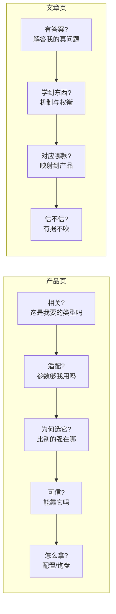

# 产品与文章资料规范（以访问者为中心）

## 第一原则

**资料是为了让访问者完成决策，不是把厂商目录倒进页面。** 每个产品、每篇文章的资料，都必须能支撑访问者在那个页面上的下一步动作。一坨没结构、没重点、没证据的资料，做出来的页面访问者看不懂、不信、走人。所以规范不是"字段齐不齐"，而是"**访问者靠这些字段能不能判断 + 信任 + 行动**"。

这份是**上游规范**（收集资料时对照"要什么、为什么"）；下游的执行在：
- 收集清单 → `site-content-and-aesthetics-spec.md` Information Intake Checklist
- 写作结构/下限 → 同文件 Per-Type Content Floors + Professional Copy Standard
- 硬性强制 → `validate_source_site_package.py` + `source-files-to-site-package.md` 的 source-wiki 契约

## 访问者的决策旅程（反推资料要供什么）

每一格访问者要回答的问题，就是资料必须供给的东西。缺一格，访问者就卡在那一步。

## 一、产品资料规范

按访问者产品页决策旅程组织。每条 = 访问者要什么 → 资料必须供给 → source-wiki 字段 → 验收判据。

**P1 · 相关性（"这是我要的类型吗"）**
- 供给：**准确的型号/料号 + 一句"是什么 + 给谁 + 头号规格"**。不是营销标题。
- 字段：`products[*].name`（型号+关键差异）、`products[*].description`（≥40 字的一句定位）、`products[*].categories`（≥1，让访问者归类/比较同族）。
- 验收：一个不懂行的人读 name+description 也能说出"这是一个 X 类、给 Y 用、主打 Z"。

**P2 · 规格适配（"参数够我用吗"）——最关键**
- 供给：**决定选型的参数集，结构化 key/value**（频率、阻抗、连接器、材料、尺寸、功率、公差、接口类型…按域）。不是埋在散文里。
- 字段：`products[*].specifications` = `[{key,value}]`。
- 验收：买家能**按这些参数筛选/比较**；散文里出现的关键数值都被抽成了结构化 spec，没漏进正文当废话。

**P3 · 差异化（"比别的强在哪"）**
- 供给：**≥2 个差异点，每个绑一个可测量属性**（相位稳定、VSWR、寿命、弯曲半径…），有数字。不是"高品质/领先"。
- 字段：`products[*].content` 第 2 段（how-built / 差异点，见 Professional Copy Standard）。
- 验收：每个卖点后面跟得上一个数字或机制；删掉任何"放到竞品页也成立"的空话。

**P4 · 信任（"能靠它吗"）**
- 供给：**材料/工艺 + 标准/认证/测试数据**（有就给，绑到 spec 或正文；没有就 flag，不编造）。
- 字段：spec（材料/标准）+ `content` 里的可证实陈述；缺失走 `needs-user-input`。
- 验收：信任性陈述都能回溯到 sourceRef；**没有编造的认证、基准、保修、库存、价格**。

**P5 · 行动（"怎么拿"）**
- 供给：**配置/订购方式**（料号编码规则、可选项）+ 询盘/报价路径。B2B 少有明码价，重点是"怎么配、找谁询"。
- 字段：`content` 第 3 段（applications + how-to-order）；询盘走站点 `contactFormPolicy`，不在产品里编联系方式。
- 验收：访问者读完知道"下一步怎么配、怎么问价"，且没有伪造的邮箱/电话/价格。

**媒体 · "让访问者看到它"**
- 供给：**一张干净的产品图**（白/中性底、统一比例、公共 CDN 直链）。图文并茂是硬要求。
- 字段：`products[*].media = {name,alt,type:'image',source:'url',url}`；缺图 flag `mediaNeeds`，别拿页面截图/箱包图凑。
- 验收：见 `site-content-and-aesthetics-spec.md` Image & Media Aesthetics + Cropping-from-PDF workflow。

**产品资料合格清单（一条产品达标 = 全绿）**
- [ ] 型号 + 一句定位 + ≥1 分类（P1）
- [ ] 结构化 spec 覆盖决定选型的参数（P2）
- [ ] ≥2 个差异点，各绑一个数字/机制（P3）
- [ ] 信任性陈述可回溯，无编造认证/价格（P4）
- [ ] 配置/询盘路径清楚（P5）
- [ ] 一张干净产品图（或明确 flag 缺图）
- [ ] 每条都指向 sourceRef；缺口 flag 不编造

## 二、文章资料规范

文章不是产品广告的复述。按访问者研究旅程组织。

**A1 · 真问题（标题 = 访问者的真问题/决策）**
- 供给：一个**目标访问者真会问的问题或要做的决策**（"怎么选 X"、"为什么 Y 决定 Z"），不是"我们产品很棒"。
- 字段：`posts[*].title`（具体、带一个有用洞见）、`posts[*].excerpt`（≥40 字，一句最锋利的洞见）。
- 验收：标题能让目标读者觉得"这正是我要搞清的"。

**A2 · 机制/权衡（"教我点能用的"）**
- 供给：**先讲清为什么、讲清读者要权衡的取舍**，教一个即使不买也有用的知识点。
- 字段：`posts[*].content` 前 2 段（痛点 hook → 机制/权衡）。
- 验收：读者读完能复述一个可用的判断依据，而不只是记住品牌名。

**A3 · 映射产品（"对应你哪款"）**
- 供给：把机制**按产品系列名自然映射**成答案，不硬卖。
- 字段：`content` 后段按名点到产品系列。
- 验收：映射读起来像"自然的答案"，不是插进来的广告。

**A4 · 有据不吹（"信不信"）**
- 供给：**每个论断/数字可回溯 sourceRef**，无编造基准/客户/数据。
- 字段：`content` 各块的 `sourceRefs`。
- 验收：抽查任一数字都能落到来源；≥3 段有实质内容，不是产品广告改写。

**A5 · 主题分类**
- 供给：文章归到一个主题桶（选型指南 / 应用笔记 / 技术解读 / 采购指南）。
- 字段：`posts[*].categories`（postCategories）。
- 验收：分类是可复用主题桶，不是把标题当分类。

**文章资料合格清单**
- [ ] 标题=真问题，excerpt=一句洞见（A1）
- [ ] ≥3 段：先痛点→机制/权衡→按名映射产品→payoff+软 CTA（A2/A3）
- [ ] 每个数字/论断可回溯，无编造（A4）
- [ ] 归入一个主题桶（A5）
- [ ] 不是产品广告的复述

## 三、把"一坨"整理成合规记录（input hygiene）

原始资料常是 PDF 一页混排、官网一段话。整理成上面规范的硬动作：

1. **一产品一记录**：一页里多个型号，拆成多条 `products[*]`，别合成一个 "Draft Product" 大块（抽取器爱犯这个，见 operational-findings 的占位问题）。
2. **规格抽成结构化**：散文里的"频率 26.5 GHz、阻抗 50Ω"抽进 `specifications`，不留在正文当废话（P2）。
3. **剥营销空话**：删"赋能/领先/高品质"这类不可证实词，只留能落到数字或机制的陈述。
4. **可回溯**：每条产品/文章绑 `sourceRefs`，指回是哪个 PDF 页/URL；用户 JSON 里自带的 ref 要重绑到 inventory（见 source-files spec）。
5. **缺口 flag 不编造**：认证/价格/联系方式/未给的规格 → `needs-user-input` 或 deferral，**绝不编**（最高红线）。
6. **PII / 价格**：真实联系方式、明码价按规则处理——不落本库、不伪造（见 site-content-and-aesthetics-spec.md Lead capture & PII）。

## 四、与下游的关系（这份是上游，谁执行）

| 层 | 文件 | 管什么 |
|---|---|---|
| 上游·为什么（访问者依据） | **本文件** | 每个字段服务访问者哪一步决策；一坨 vs 合规的判据 |
| 收集清单 | `site-content-and-aesthetics-spec.md` Information Intake Checklist | 建站需收齐哪些信息 |
| 写作结构/下限 | 同文件 Per-Type Content Floors + Professional Copy Standard | 产品 3 段 what/how/applications、文章 hook→机制→映射→CTA |
| source-wiki 结构契约 | `source-files-to-site-package.md` | `products[*].content`/`specifications`/`sourceRefs` 的形状 |
| 硬性强制·结构 | `validate_source_site_package.py` | publication-ready floors、token 占位/PII 拒绝、policy 必填集 |
| 硬性强制·内容质量（发布前闸） | `check_content_quality.py` | 库存图/产品图缺 alt/未替换占位=硬拦(block)；规格-品类冲突/参数表过薄(<3)/重复文案=warn + AI 自审清单。补结构校验够不着的"内容是不是真的、对不对题、够不够决策级" |

**用法**：收集/整理资料时先对照本文件的"访问者要什么"，再落到 Intake Checklist 的字段，最后由校验器强制。三者一致：本文件说"为什么该有"，checklist 说"收什么"，校验器说"不达标就拒"。
